<a id="top"></a>

<div align="center">

# Carbon Ledger
### Dual-Engine Carbon & Treasury Controller

*A 20-region, carbon-aware workload simulator with an ONNX controller, a classical GLPK solver, a Qiskit QAOA path, and a reproducible experiment workspace.*


[Quick Start](#2-quick-start) · [Architecture](#3-architecture) · [Controller](#4-the-controller) · [Experiment Workspace](#6-experiment-workspace) · [Quantum Pipeline](#7-quantum--ml-pipeline) · [API](#8-api-reference) · [Configuration](#10-configuration) · [Troubleshooting](#15-troubleshooting)

</div>

---

## Table of Contents

| # | Section | What you will find |
|---|---------|--------------------|
| 1 | [Overview](#1-overview) | What the project does, key numbers, who it is for |
| 2 | [Quick Start](#2-quick-start) | Windows launcher, manual setup, optional Qiskit runtime |
| 3 | [Architecture](#3-architecture) | System map, request lifecycle, runtime tiers |
| 4 | [The Controller](#4-the-controller) | Engine fallback chain, cost model, treasury split, manual override |
| 5 | [Dashboard](#5-dashboard) | Live control plane panels and what feeds them |
| 6 | [Experiment Workspace](#6-experiment-workspace) | Nine tabs, scheduler, forecasting, replay, stress tests, approval flow |
| 7 | [Quantum & ML Pipeline](#7-quantum--ml-pipeline) | Qiskit → PyTorch → ONNX, QAOA circuit, local vs serverless bridge, fair benchmark |
| 8 | [API Reference](#8-api-reference) | Every route, method, and purpose |
| 9 | [Data & Reproducibility](#9-data--reproducibility) | CSV schema, seeds, JSON snapshots, IndexedDB |
| 10 | [Configuration](#10-configuration) | Every environment variable |
| 11 | [Project Structure](#11-project-structure) | Annotated file tree |
| 12 | [Testing & Validation](#12-testing--validation) | Commands, coverage areas, recorded results |
| 13 | [Deployment](#13-deployment) | Local, Vercel, Kubernetes export |
| 14 | [Limitations & Honesty Notes](#14-limitations--honesty-notes) | What the project does *not* claim |
| 15 | [Troubleshooting](#15-troubleshooting) | Common failures and fixes |
| 16 | [Glossary](#16-glossary) | Terms used across the docs |

### Choose your path

| I want to… | Go to |
|---|---|
| Run it in five minutes | [Quick Start](#2-quick-start) |
| Understand how a placement decision is made | [The Controller](#4-the-controller) → [Cost model](#42-cost-model-and-constraints) |
| Plan jobs with deadlines, capacity and dependencies | [Experiment Workspace](#6-experiment-workspace) → [Scheduler](#63-scheduler-algorithm) |
| Import my own hourly data | [Data & Reproducibility](#9-data--reproducibility) |
| Understand the quantum and ONNX parts | [Quantum & ML Pipeline](#7-quantum--ml-pipeline) |
| Add an API key (Groq / Electricity Maps) | [Configuration](#10-configuration) |
| Deploy it | [Deployment](#13-deployment) |
| Know what it can and cannot claim | [Limitations](#14-limitations--honesty-notes) |

---

## 1. Overview

**Carbon Ledger** decides *where* and *when* to run compute workloads across **20 cloud regions** so that the blended cost of **energy + carbon charge + data egress** is as low as possible, while respecting latency SLAs, data-residency rules (India-only / DPDP-style locking), capacity, dependencies and deadlines. It also links emissions to money through a **treasury layer** (liquid funds, green bonds, carbon futures, offsets, stress tests).

### At a glance

| Item | Value |
|---|---|
| Regions modelled | **20** (7 Asia-Pacific, 7 Europe, 6 Americas/Africa) |
| Optimisation engines | **ONNX** surrogate · **GLPK** (WebAssembly) · **Qiskit QAOA** (local simulator) · safe **greedy** fallback |
| Demo dataset | **168 hours** of deterministic synthetic telemetry, seed `42` |
| Experiment workspace | **9 tabs** (Overview → Execution) |
| Database required | **None** (browser IndexedDB + JSON exports) |
| Execution | **Dry-run only**; exports *suspended* Kubernetes Jobs |
| Validation record | 63 Node tests + 2 Python tests, typecheck, lint, production build |

### Capabilities map

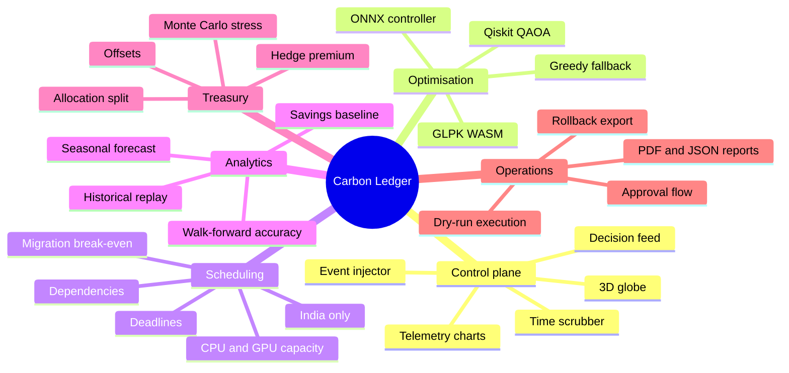

<sub>[↑ Back to top](#top)</sub>

---

## 2. Quick Start

### 2.1 Requirements

| Tool | Version | Needed for |
|---|---|---|
| Node.js | **22.13+** (24 LTS recommended) | Everything |
| npm | bundled with Node | Dependencies |
| Python | 3.12 recommended (`>=3.12,<3.15`) | *Optional:* local Qiskit simulator, model retraining |

### 2.2 Windows (one click)

1. Unzip the project into a fresh folder.
2. Double-click **`start.bat`**.
3. Pick an option:

| Option | Starts | Python needed |
|:---:|---|:---:|
| **1** | Next.js + local Qiskit simulator (via `start-local.bat`) | Yes |
| **2** | Next.js only (dashboard, experiments, ONNX, GLPK) | No |
| **3** | Vercel local emulator (no deployment) | Needs Vercel setup |
| **4** | Exit | — |

4. Open <http://localhost:3000> → **Launch dashboard** (`/dashboard`) → **Open experiment workspace** (`/experiments`).

> Option 1 installs Python dependencies and can take several minutes on the first launch.

### 2.3 Manual setup (any OS)

```bash
npm ci --onnxruntime-node-install=skip
npm run dev
```

The skip flag avoids optional acceleration downloads; the bundled native CPU ONNX runtime is still used. Do **not** reuse an old `node_modules` or `.next` folder.

### 2.4 Optional: local Qiskit runtime (macOS / Linux)

```bash
python3 -m venv qiskit_train/.venv
qiskit_train/.venv/bin/python -m pip install -r requirements.txt
npm run dev
```

The bridge looks for `qiskit_train/.venv/Scripts/python.exe` (Windows) or `qiskit_train/.venv/bin/python` (elsewhere). Override with `QUANTUM_PYTHON_PATH`. See [Local vs serverless bridge](#73-local-vs-serverless-bridge).

### 2.5 What works with no API keys

Demo data, CSV imports, scheduling, replay, reports, classical/ONNX benchmarks, local storage and the local Qiskit simulation all work **without any key**. Keys only enable [Groq narratives](#10-configuration) and [live carbon intensity](#10-configuration).

### 2.6 Page routes

| Route | Purpose |
|---|---|
| `/` | Landing page (feature overview, five-step loop) |
| `/dashboard` | Live control plane |
| `/experiments` | Nine-tab experiment workspace |

<sub>[↑ Back to top](#top)</sub>

---

## 3. Architecture

### 3.1 System map

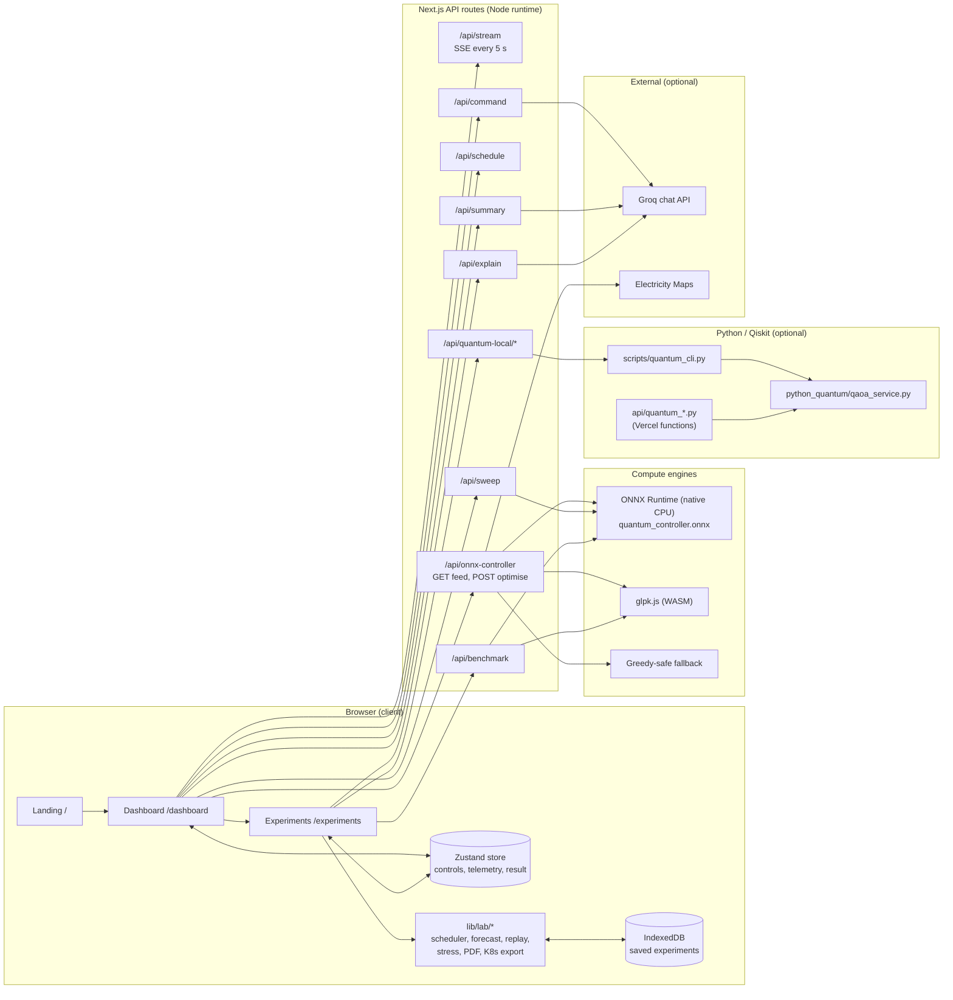

**Design principles**

| Principle | How it shows up |
|---|---|
| Local-first | No database, no required cloud; state lives in the browser and JSON exports |
| Graceful degradation | ONNX → GLPK → greedy; Groq → deterministic text; Electricity Maps → synthetic feed |
| Honest accounting | Savings are withheld when a plan leaves jobs unserved; no fabricated measurements |
| Reproducibility | Seeded data, versioned JSON snapshots, fingerprinted approvals |

### 3.2 Request lifecycle (`POST /api/onnx-controller`)

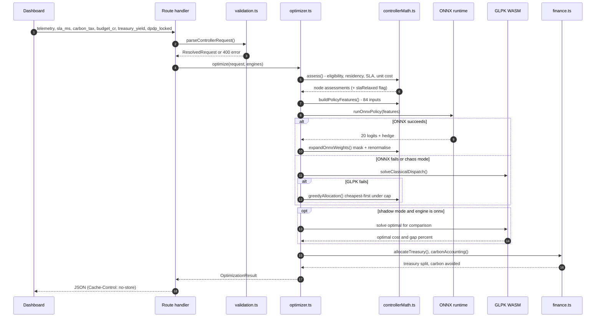

### 3.3 Runtime tiers

| Tier | Runs where | Needs Python | Notes |
|---|---|:---:|---|
| **Browser UI** | Client | No | React 19, Recharts, Three.js globe, Zustand |
| **Experiment engine** (`lib/lab/*`) | Client | No | Scheduling, replay, stress tests, PDF, K8s export all run in the browser |
| **API routes** | Node runtime | No | ONNX inference, GLPK, benchmark, Groq proxies |
| **Qiskit simulator** | Local process or Vercel Python function | **Yes** | Optional; spawned per request locally |
| **Offline training** | Developer machine | **Yes** | Generates labels and retrains the ONNX surrogate |

<sub>[↑ Back to top](#top)</sub>

---

## 4. The Controller

The controller turns a snapshot of 20 regions plus four user controls into **node weights** (share of workload per region) and a **treasury allocation**.

### 4.1 Engine fallback chain

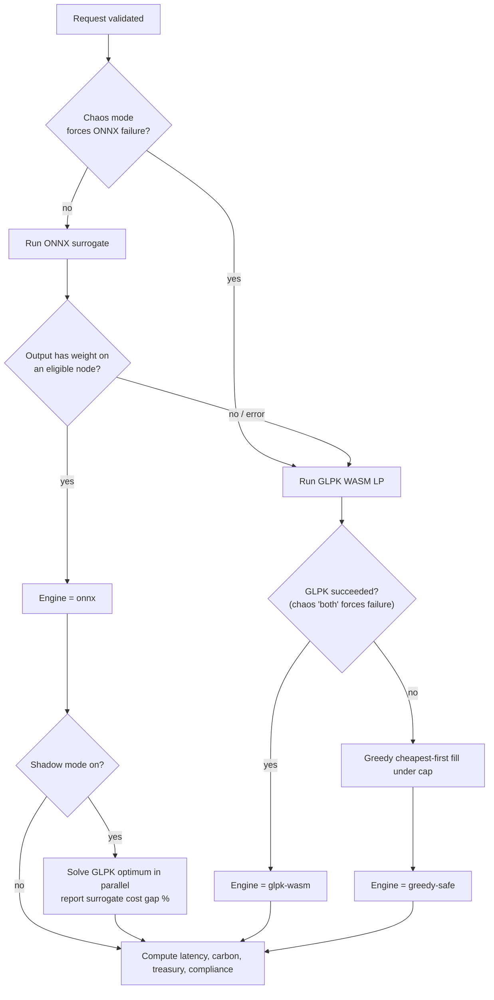

| Engine value | Meaning | `fallback_reason` |
|---|---|---|
| `onnx` | Surrogate policy produced usable weights | `null` |
| `glpk-wasm` | Exact linear program solved in WebAssembly | e.g. `ONNX unavailable: ...` |
| `greedy-safe` | Last-resort cheapest-first fill | ONNX reason plus `glpk.js unavailable: ...` |

### 4.2 Cost model and constraints

**Per-region unit cost (USD/kWh)**

```text
energy  = energy_price / 1000
carbon  = carbon_tax × 0.25 × carbon_ci / 1000
egress  = egress_cost_gb × 0.05
total   = energy + carbon + egress
```

| Symbol | Meaning | Range / unit |
|---|---|---|
| `carbon_tax` | Controller carbon weight; `1` ⇒ 0.25 USD/kg | 0 – 1 |
| `carbon_ci` | Carbon intensity | gCO₂/kWh |
| `energy_price` | Wholesale-style energy price | USD/MWh |
| `egress_cost_gb` | Data egress price | USD/GB |
| `sla_ms` | Latency SLA | 10 – 100 ms |
| `budget_cr` | Treasury budget | 10 – 100 crore INR |

**Eligibility rules (evaluated per region)**

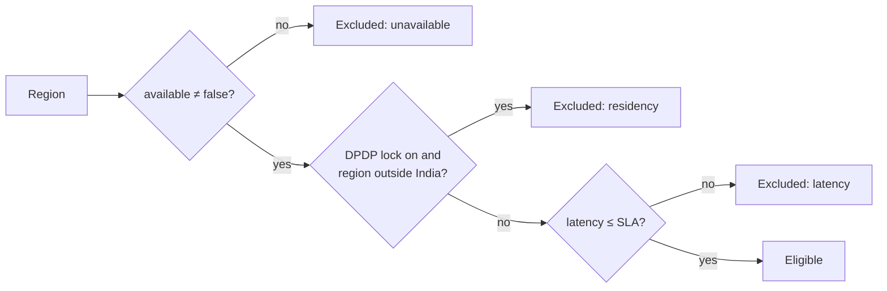

| Rule | Detail |
|---|---|
| **Indian regions** | `ap-south-1` (Mumbai), `ap-south-2` (Hyderabad), `asia-south2` (Delhi) |
| **Weight cap** | `1` if ≤ 1 eligible node, otherwise `max(0.7, 1 / eligibleCount)` |
| **SLA relaxation** | If *no* node meets the SLA but some are residency-compliant, the lowest-latency compliant node is used as best effort and flagged `SLA_BREACH` |
| **No residency-compliant node** | Request fails with an input error (HTTP 4xx) |
| **Greedy fill** | Sort eligible nodes by cost, give each `min(cap, remaining)` |

### 4.3 Treasury allocation

The model's **hedge fraction** is converted into a three-way split:

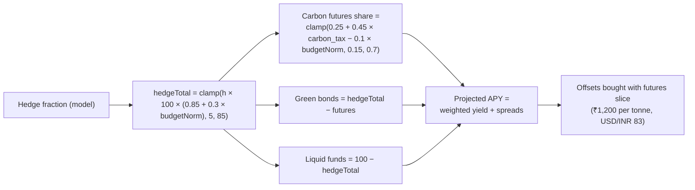

| Constant | Value |
|---|---|
| Green bond spread | +0.85 pp over base yield |
| Carbon futures spread | +2.10 pp over base yield |
| Offset price | ₹1,200 / tCO₂ |
| Fleet load | 240 MWh/day |
| Default treasury yield | 6.8 % |

### 4.4 Manual override

`lib/override.ts` lets you drag allocation sliders (`AllocationEditor`). Weights are re-normalised, ineligible regions are locked to 0, the same per-region cap applies, and carbon/treasury figures are recomputed (`applyOverride`). The result carries a `manual_override` marker so the UI can distinguish hand-set from optimiser-set plans.

<sub>[↑ Back to top](#top)</sub>

---

## 5. Dashboard

The dashboard (`components/ControllerDashboard.tsx`) is the live control plane. Each panel is wrapped in an error boundary so one failure cannot blank the page.

### 5.1 Panel map

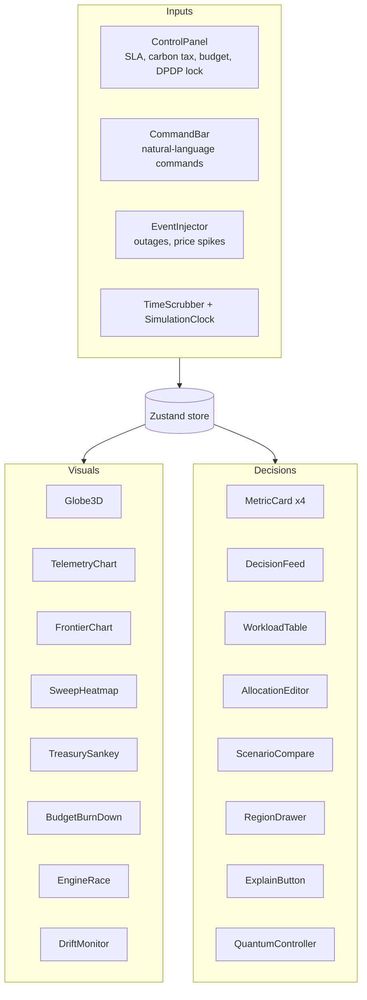

| Panel | Purpose |
|---|---|
| `Globe3D` | 3D globe of the 20 regions with live metrics |
| `TelemetryChart` | Carbon, price and latency over the simulated day |
| `FrontierChart` / `SweepHeatmap` | Cost-versus-carbon frontier; 10 × 10 SLA × carbon-tax sweep |
| `EngineRace` | ONNX vs GLPK timing against a target |
| `DriftMonitor` | Detects divergence (`lib/anomaly.ts`) |
| `DecisionFeed` | Chronological log of controller decisions (exportable as CSV / BRSR-style summary via `lib/decisionLog.ts`) |
| `ScenarioCompare` | Save scenarios A and B and compare outcomes |
| `QuantumController` | Submit a QAOA run for the current candidates |
| `ExplainButton` | "Explain what's happening" narrative (Groq, with deterministic fallback) |
| `CommandBar` | Plain-language commands such as *"India only, 20 ms, maximum green"* |

### 5.2 Data feeds

| Feed | Source | Cadence |
|---|---|---|
| Telemetry stream | `/api/stream` (Server-Sent Events; synthetic diurnal data) | every **5 s** |
| Regional feed | `GET /api/onnx-controller` → `lib/feeds/registry.ts` | 5-minute cache for Electricity Maps |
| Simulation clock | `lib/simClock.ts` | 1 simulated day = **60 s** |
| Autopilot | `lib/autopilot.ts` | Eases controls toward net-zero targets (SLA 30 ms, tax 0.88, budget 72) |

### 5.3 Natural-language commands

`/api/command` first tries a **deterministic parser** (keywords such as *india*, *dpdp*, *greenest*, *cheapest*, `NN ms`, `NN crore`, *strict*), then optionally asks **Groq** for a JSON control patch. Responses carry a `source` (`deterministic` or `groq`) and a `confidence`.

<sub>[↑ Back to top](#top)</sub>

---

## 6. Experiment Workspace

`/experiments` is a **client-side** workspace for reproducible what-if studies.

### 6.1 Nine tabs

| Tab | Purpose | Key outputs |
|---|---|---|
| **Overview** | Baseline vs optimised savings, data provenance, CSV import/export | Net savings, avoided emissions, jobs scheduled, migration overhead |
| **Workloads** | Edit jobs (duration, CPU/GPU, kWh, data size, deadline, earliest start, latency, India-only, dependencies) | Up to 50 jobs |
| **Decisions** | "Why this placement?" per job | Move / wait / stay, cost breakdown, break-even, rejected regions, optional Groq text |
| **Replay** | Past-only historical replay in non-overlapping windows | Realised cost, CO₂, violations, cumulative savings |
| **Forecasts** | Seasonal forecast with measured accuracy | MAE, empirical 90 % band coverage |
| **Benchmarks** | Fair engine comparison on one objective | GLPK vs exact vs ONNX vs Qiskit |
| **Treasury** | Seeded Monte Carlo stress test | Mean, P95, tail mean, shortfall probability, CSV |
| **Experiments** | Save / load / import / export scenarios | IndexedDB + JSON snapshots, advanced JSON editor |
| **Execution** | Approval → dry-run → rollback | Kubernetes Job exports, audit trail |

### 6.2 Data flow

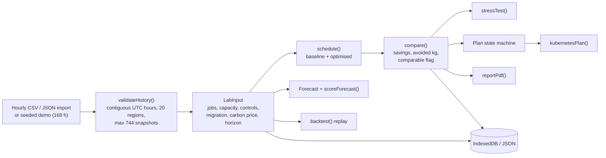

### 6.3 Scheduler algorithm

A deterministic **deadline-first greedy scheduler** (not a global job-shop optimiser).

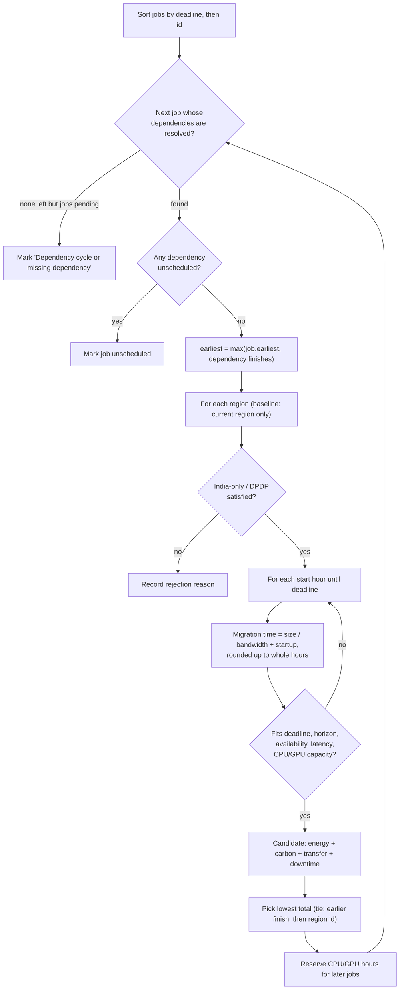

**Accounting rules**

| Component | Formula / rule |
|---|---|
| Runtime energy | `kWh / duration × energy_price / 1000` per runtime hour |
| Carbon charge | `(job kg + transfer kg) × USD-per-tonne / 1000` |
| Transfer | Source egress price × data size; energy uses the mean of source/destination |
| Downtime | `downtimeUsdPerHour × migration hours` |
| **Total** | **energy + carbon charge + transfer + downtime** |
| Excluded | Compute rental, storage rental, monetary SLA penalties, embodied emissions |
| Baseline | Stay in the current region, start at first feasible hour |
| Fairness | Savings are **withheld** (`comparable = false`) if either plan leaves a job unserved |

### 6.4 Migration break-even

For each chosen move the workspace reports whether to **move**, **wait** or **stay**, and the **break-even runtime**: the number of runtime hours at which the hourly operating saving repays transfer cost, downtime and transfer emissions. If the destination is not cheaper per hour, break-even is reported as *no operating-cost payback*.

### 6.5 Forecasting and replay

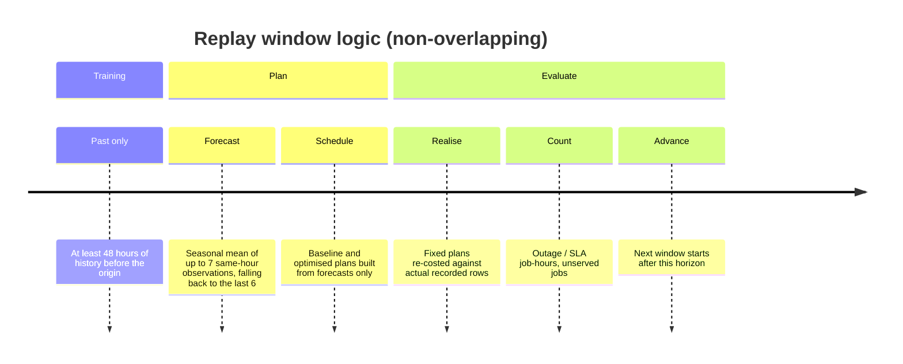

| Topic | Rule |
|---|---|
| Forecast inputs | Only snapshots **strictly before** the origin |
| Method | Seasonal historical mean with persistence fallback |
| Accuracy | One-hour **walk-forward** MAE |
| Bands | Empirical 90th percentile of past absolute errors; ≥ 12 residuals needed before coverage is scored |
| Caveat | Multi-hour band coverage is **not** calibrated per lead time |
| Replay minimum | 48 training hours + one complete horizon |
| Failed jobs | Counted, never retried automatically |

### 6.6 Treasury stress tests

Seeded correlated energy/carbon shocks over the plan's operating costs.

| Input | Meaning |
|---|---|
| Carbon / energy shock (%) | Mean shock applied to prices |
| Shock range / volatility (%) | Random spread |
| Hedge (% of carbon exposure) and premium (%) | Fixes exposure at a cost |
| Cash and required reserve (USD) | For shortfall probability |
| Seed and runs (100 – 5000) | Reproducibility and precision |

**Outputs:** mean stressed cost, 95th percentile, worst-5 % mean, shortfall probability, largest shortfall, and a CSV of all outcomes.

### 6.7 Plan lifecycle

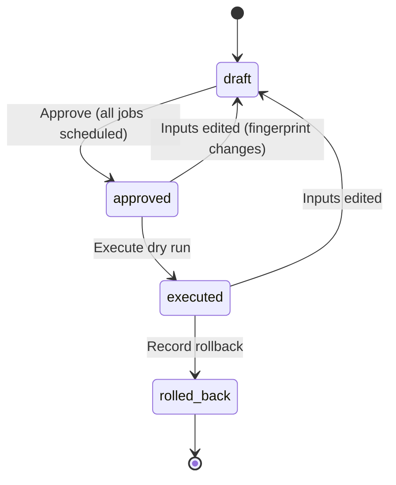

| Rule | Detail |
|---|---|
| Fingerprint | Hash of scenario inputs; any edit invalidates approval |
| Approval gate | Disabled while any job is unscheduled |
| Kubernetes export | **Suspended** Jobs with placeholder images, regional node selectors, CPU/GPU requests |
| Rollback export | New suspended Jobs in original regions; **cannot undo completed work** |
| Audit | Local list of `{at, action, detail}`; **not tamper-proof** |

<sub>[↑ Back to top](#top)</sub>

---

## 7. Quantum & ML Pipeline

### 7.1 Training pipeline

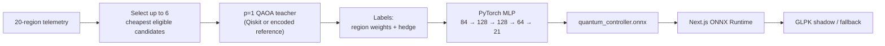

| Artifact | Detail |
|---|---|
| Model | `public/models/quantum_controller.onnx` (≈ 149 KB) |
| Version | `v3-qaoa-surrogate-20r` |
| Input (84) | 20 regions × 4 normalised features (carbon, price, latency, egress) + 4 globals (yield, carbon tax, SLA, budget) |
| Output (21) | 20 region logits + 1 hedge logit; runtime applies softmax / sigmoid and masks ineligible regions |
| Training | 320 samples, 700 epochs, seed `20261004` |
| Reported error | weight RMSE ≈ 0.027, hedge RMSE ≈ 0.041 |
| Teacher | **Encoded p=1 QAOA reference teacher** (bundled model); `qiskit_qaoa.py` is the true-Qiskit reproduction path |
| v5 repair | Added a missing named output (Identity node); weights unchanged |

> **Important:** the bundled ONNX file was trained from the included encoded reference teacher, not from fresh Qiskit labels. This is recorded in `qiskit_train/artifacts/training_manifest.json`.

**Rebuild commands**

```bash
npm run model:build            # rebuild ONNX from the reference teacher
npm run model:qaoa-labels      # generate Qiskit labels (needs Qiskit)
npm run model:train-qiskit     # train surrogate from Qiskit labels
npm run quantum:python-check   # print the installed Qiskit version
```

### 7.2 QAOA circuit

| Property | Value |
|---|---|
| Ansatz | `QAOAAnsatz`, `reps = 1` (two parameters: β, γ) |
| Qubits | **candidates + 1** (up to 6 candidates + 1 hedge bit = 7) |
| Cost operator | Diagonal: Σ cost·bit + hedge·bit + **one-hot penalty** `8.0 × (selected − 1)²` |
| Parameter search | Coarse grid, default **3 × 3** (`QUANTUM_PARAMETER_GRID`) |
| Evaluation | Exact `Statevector` probabilities decoded to weights; only one-hot states count |
| Reporting | **Penalised circuit energy is *not* a USD cost**; placement cost is reported separately |

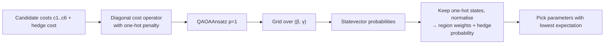

### 7.3 Local vs serverless bridge

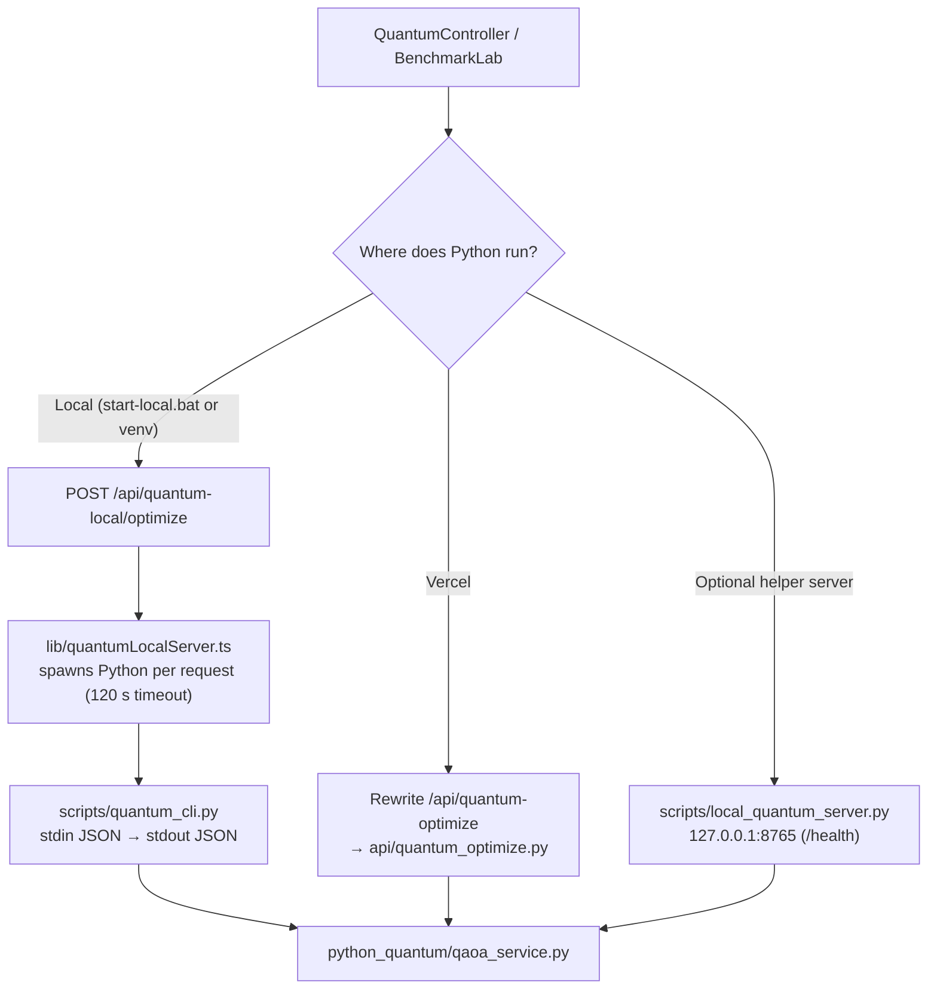

| Mode | Entry | Notes |
|---|---|---|
| Local per-request process | `/api/quantum-local/{optimize,status}` | No background port needed |
| Helper server | `scripts/local_quantum_server.py`, `scripts/check_quantum_local.py` | Health at `http://127.0.0.1:8765/health` |
| Vercel | `api/quantum_optimize.py`, `api/quantum_status.py` | Max duration 120 s / 60 s per `vercel.json` |

The simulator completes **synchronously**, so there are never queued jobs to poll.

### 7.4 Fair benchmark

`POST /api/benchmark` isolates *placement cost only* so engines are comparable.

```text
cost = energy_price/1000 + carbon_tax × 0.25 × carbon_ci/1000 + egress_cost_gb × 0.05
```

| Rule | Detail |
|---|---|
| Candidates | Up to **6** strictly eligible regions (SLA never relaxed) |
| Constraints | `sum(weights) = 1`, cap `= 1`, treasury hedge disabled |
| Engines | GLPK, exact enumeration, ONNX projected onto candidates, Qiskit simulator (from the UI) |
| Metrics | Cost, gap vs exact (%), compute ms, init ms, feasibility |
| Safety | Missing engines return an explicit error row — **no measurement is fabricated** |
| Setting | Keep `QUANTUM_MAX_CANDIDATES=6`; mismatched candidate sets are flagged infeasible |
| Claim | **No quantum advantage is claimed** |

<sub>[↑ Back to top](#top)</sub>

---

## 8. API Reference

All routes use the Node.js runtime. Controller responses send `Cache-Control: no-store`.

| Route | Method | Purpose | Max duration |
|---|:---:|---|:---:|
| `/api/onnx-controller` | GET | Regional telemetry feed (Electricity Maps if configured, else synthetic) | 10 s |
| `/api/onnx-controller` | POST | Run the dual-engine optimiser | 10 s |
| `/api/stream` | GET | Server-Sent Events `telemetry` every 5 s | 60 s |
| `/api/schedule` | POST | Legacy lightweight scheduler for the dashboard | 8 s |
| `/api/sweep` | POST | 10 × 10 SLA × carbon-tax sweep | 10 s |
| `/api/command` | POST | Text → control changes (deterministic, then Groq) | 8 s |
| `/api/summary` | POST | Narrated "what's happening" (Groq or deterministic) | 10 s |
| `/api/explain` | POST | Explain a calculated scheduling decision (input ≤ 16 KB) | 10 s |
| `/api/benchmark` | POST | Fair engine benchmark | 30 s |
| `/api/quantum-local/optimize` | POST | Local Qiskit QAOA run | 125 s |
| `/api/quantum-local/status` | POST | Local Qiskit availability / job status | 65 s |
| `/api/quantum-optimize` *(Vercel rewrite)* | POST | Serverless Qiskit run | 120 s |
| `/api/quantum-status` *(Vercel rewrite)* | POST | Serverless Qiskit job status | 60 s |

<details>
<summary><b>Example: optimise request</b></summary>

```json
{
  "sla_ms": 25,
  "carbon_tax": 0.5,
  "budget_cr": 50,
  "treasury_yield": 6.8,
  "dpdp_locked": false,
  "shadow": true,
  "chaos": "none"
}
```

`telemetry` is optional; omit it to use the synthetic feed. `chaos` may be `none`, `onnx` (force ONNX failure) or `both` (force ONNX and GLPK failure to exercise the greedy fallback).

</details>

<details>
<summary><b>Result shape (abridged)</b></summary>

```text
engine, fallback_reason, ai_architecture
allocations   { node_weights, treasury{liquid, green_bonds, carbon_futures, apy}, hedge_pct }
latency       { execution_ms, init_ms, weighted_network_ms, max_used_latency_ms, sla_ms, sla_compliant }
carbon_avoided{ gross_tco2_per_day, net_footprint_mt, carbon_avoided_t, offset_pct, offset_roi_pct,
                blended_ci, baseline_ci, ci_shift_pct }
cost          { blended_unit_cost_usd_per_kwh, operating_cost_usd_per_day }
compliance    { status, dpdp_locked, residency_ok, excluded[], notes[] }
nodes[]       per-region metrics, weight, eligibility, exclusion reason
shadow        { optimal_cost, surrogate_cost, cost_gap_pct }
engine_race   { onnx_ms, glpk_ms, target_ms }
```

</details>

<sub>[↑ Back to top](#top)</sub>

---

## 9. Data & Reproducibility

### 9.1 Dataset

The initial dataset is **168 hours** of **deterministic synthetic telemetry** seeded with `42`. It is visibly labelled and is **not** live market or measured data.

### 9.2 Hourly CSV schema

```csv
timestamp,region,carbon_ci,energy_price,latency_ms,egress_cost_gb,available,source
```

| Column | Unit / allowed values |
|---|---|
| `timestamp` | Unique UTC hour; hours must be **contiguous** |
| `region` | One of the **20** catalog region codes (every hour must contain all 20) |
| `carbon_ci` | gCO₂/kWh |
| `energy_price` | USD/MWh |
| `latency_ms` | ms |
| `egress_cost_gb` | USD/GB |
| `available` | `true` / `false` |
| `source` | `mock`, `electricity-maps`, or `stale` |

Maximum: **744** hourly snapshots (31 days). Import from **Overview**; the forecast origin moves to the hour after the latest observation (you can set another UTC origin).

### 9.3 Region catalog

| Group | Regions |
|---|---|
| **Asia-Pacific (7)** | Mumbai `ap-south-1`, Hyderabad `ap-south-2`, Delhi `asia-south2`, Singapore, Tokyo, Seoul, Sydney |
| **Europe (7)** | Frankfurt, Dublin, London, Stockholm, Paris, Madrid, Zurich |
| **Americas / Africa (6)** | Virginia, Oregon, Iowa, Toronto, São Paulo, Johannesburg |

### 9.4 Persistence and exports

| Mechanism | Scope | Notes |
|---|---|---|
| **IndexedDB** | This browser + origin | Saved experiments; not cloud sync |
| **JSON snapshot** | Portable | Full history, jobs, capacities, controls, seed, version, results, treasury settings, benchmark snapshot, audit |
| **Import** | Validated | Recalculates scheduling and **resets approval** |
| **PDF report** | Download | Assumptions, scheduling, replay, accuracy, audit, benchmark snapshot |
| **Decision log** | Browser localStorage | CSV and BRSR-style summary export |

### 9.5 Provenance

The Electricity Maps adapter supplies **carbon intensity only**. Energy price, latency, egress cost and capacity remain model inputs. The workspace labels each metric's provenance.

<sub>[↑ Back to top](#top)</sub>

---

## 10. Configuration

Copy `.env.example` to `.env.local` and fill only what you use. Keys stay **server-side**; no real keys ship in this archive.

| Variable | Default | Purpose |
|---|---|---|
| `ELECTRICITY_MAPS_API_KEY` | *(empty)* | Optional live carbon intensity |
| `ELECTRICITY_MAPS_API_VERSION` | `v4` | API version |
| `GROQ_API_KEY` | *(empty)* | Optional commands, summaries, explanations |
| `GROQ_MODEL` | `openai/gpt-oss-20b` | Chat model id |
| `GROQ_API_KEY_2` / `GROQ_MODEL_2` | *(empty)* | Optional backup key and model |
| `GROQ_STRATEGY` | `failover` | `failover` (backup only on failure) or `balance` (alternate keys) |
| `QUANTUM_MAX_CANDIDATES` | `6` | Candidate count for QAOA (keep `6` for the benchmark) |
| `QUANTUM_PARAMETER_GRID` | `3` | β/γ grid size per axis |
| `QUANTUM_SHOTS` | `512` | Shot setting read by the service |
| `QUANTUM_ONE_HOT_PENALTY` | `8.0` | One-hot constraint penalty |
| `QUANTUM_PYTHON_PATH` | *(auto)* | Override the Python executable |
| `QUANTUM_LOCAL_PYTHON_URL` | `http://127.0.0.1:8765` | Local helper URL |
| `QUANTUM_LOCAL_PORT` | `8765` | Local helper port |
| `NEXT_PUBLIC_QUANTUM_LOCAL` | *(empty)* | Set by `start-local.bat` to enable local mode in the UI |
| `VERCEL_SUPPORT_LARGE_FUNCTIONS` | `0` | Only if the Python bundle exceeds the standard limit |

**Groq failover**

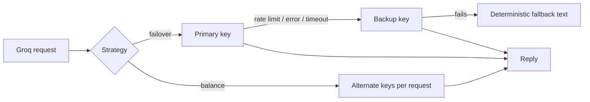

<sub>[↑ Back to top](#top)</sub>

---

## 11. Project Structure

```text
carbon-treasury-controller-v5/
├── app/
│   ├── page.tsx                  # Landing page
│   ├── dashboard/page.tsx        # Dashboard entry
│   ├── experiments/page.tsx      # Nine-tab workspace
│   ├── layout.tsx, globals.css   # Shell and theme
│   └── api/
│       ├── onnx-controller/      # Optimiser + regional feed
│       ├── stream/               # SSE telemetry
│       ├── schedule/  sweep/     # Legacy scheduler, SLA x tax sweep
│       ├── command/  summary/  explain/   # Groq-assisted, deterministic fallback
│       ├── benchmark/            # Fair engine benchmark
│       └── quantum-local/        # optimize + status
├── components/                   # Dashboard panels, BenchmarkLab, Globe3D, etc.
├── lib/
│   ├── controllerMath.ts         # Eligibility, unit cost, weight cap, ONNX features
│   ├── optimizer.ts              # Engine orchestration and fallback chain
│   ├── finance.ts                # Treasury split and carbon accounting
│   ├── onnxInference.ts          # Native ONNX Runtime wrapper
│   ├── classicalWasmSolver.ts    # GLPK WebAssembly LP
│   ├── override.ts               # Manual weight overrides
│   ├── scheduler.ts              # Legacy lightweight scheduler
│   ├── validation.ts             # Request validation
│   ├── mockData.ts, regions.ts   # Synthetic telemetry, 20-region catalog
│   ├── groq.ts                   # Dual-key Groq client
│   ├── feeds/registry.ts         # Electricity Maps adapter + fallback
│   ├── quantumClient.ts          # Browser-side QAOA client
│   ├── quantumLocalServer.ts     # Spawns local Python
│   ├── store.ts                  # Zustand store
│   ├── decisionLog.ts, situation.ts, autopilot.ts, anomaly.ts, ...
│   └── lab/                      # v5 experiment engine
│       ├── engine.ts             # Validation, scheduling, compare, fingerprint, plan transitions
│       ├── analytics.ts          # Forecast, backtest, stress test, CSV
│       ├── report.ts             # PDF report + Kubernetes export
│       ├── persistence.ts        # IndexedDB + downloads
│       └── types.ts
├── python_quantum/qaoa_service.py   # Qiskit QAOA service
├── api/quantum_{optimize,status}.py # Vercel Python functions
├── qiskit_train/                    # Teacher, training, artifacts, manifest
├── scripts/                         # build_onnx_model, quantum_cli, local server, checks
├── public/models/quantum_controller.onnx
├── public/brand/                    # Logos and background
├── tests/                           # 10 TypeScript test files + 1 Python test
├── start.bat  start-local.bat       # Windows launchers
├── vercel.json  next.config.ts  .env.example
├── VALIDATION.md
└── package.json  requirements.txt  pyproject.toml
```

### Technology stack

| Layer | Libraries |
|---|---|
| Framework | Next.js 15, React 19, TypeScript 5.7 |
| UI | Tailwind CSS 3, Framer Motion, Lucide, Sonner |
| Charts / 3D | Recharts, d3-sankey, Three.js with React Three Fiber / Drei |
| State | Zustand |
| Optimisation / ML | `onnxruntime-node`, `glpk.js` |
| Quantum | Qiskit 2.5.2 (Python) |
| Export | `html-to-image`, in-house PDF writer |

<sub>[↑ Back to top](#top)</sub>

---

## 12. Testing & Validation

```bash
npm test            # Node test runner (TypeScript, stripped types)
npm run typecheck   # tsc --noEmit
npm run lint        # ESLint
npm run build       # Production build
```

Python quantum test: `tests/test_quantum.py` (requires Qiskit).

### 12.1 What the tests cover

| Area | Examples |
|---|---|
| Controller | DPDP lock confines weight to India; latency SLA excludes slow nodes; ONNX → GLPK → greedy fallbacks; SLA-breach flag; residency failure |
| Treasury | Split sums to 100 %; offsets respond to budget |
| Groq | No-key behaviour; backup registration; primary-first; failover; balance strategy |
| Lab engine | Default scenario schedules all jobs; savings accounting; zero capacity never invents savings; no capacity double-booking; dependency ordering |
| Native engines | Real ONNX inference and GLPK WASM |
| Quantum | Local bridge, QAOA pipeline, live Qiskit statevector run |

### 12.2 Recorded results (from `VALIDATION.md`)

| Check | Result |
|---|---|
| Environment | Node 24.19, Next.js 15.5.27, Python 3.12, Qiskit 2.5.2 |
| Node tests | 63 passing |
| Python tests | 2 passing |
| Typecheck / lint / build | Pass |
| Browser (Chromium) | All nine sections open; IndexedDB survives reload; approve → execute → rollback; PDF/JSON downloads; fallback explanation; benchmark table; no horizontal overflow at 390 px |

Passing checks are evidence for **tested paths**, not a guarantee against all future input, provider or deployment failures.

<sub>[↑ Back to top](#top)</sub>

---

## 13. Deployment

### 13.1 Options

| Target | Command / action | Qiskit |
|---|---|---|
| Local dev | `npm run dev` | Optional via venv |
| Local production | `npm run build && npm start` | Optional via venv |
| Windows launcher | `start.bat` | Option 1 |
| Vercel | Import the repo; set env vars in project settings | Python functions per `vercel.json` |

### 13.2 Vercel notes

- `vercel.json` rewrites `/api/quantum-optimize` and `/api/quantum-status` to the Python functions and sets per-route `maxDuration`.
- `next.config.ts` keeps `onnxruntime-node` and `glpk.js` as external server packages and bundles `public/models/**` into the ONNX, sweep and benchmark routes.
- Non-Linux-x64 ONNX binaries are excluded from the trace to reduce size.
- If your plan limits Python bundles or duration, run the Python backend separately and adapt the quantum endpoints. The ordinary experiment workspace is client-side except for optional explanations and engine benchmarks.
- Vercel deployment and authenticated provider calls were **not** exercised in validation.

### 13.3 Execution integration

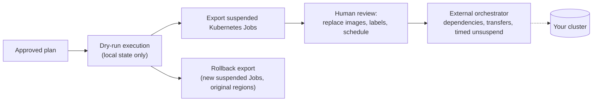

No cluster connection or automatic deployment is included. Exported timestamps do **not** schedule anything automatically.

<sub>[↑ Back to top](#top)</sub>

---

## 14. Limitations & Honesty Notes

| Area | Boundary |
|---|---|
| Data | Demo telemetry is **synthetic**. No claim of live-market performance |
| Quantum | QAOA runs on a **simulator** (p = 1, ≤ 6 candidates). **No quantum advantage** is claimed |
| ONNX | Surrogate trained from the encoded reference teacher; ONNX training and calibration were not rerun in v5 |
| Scheduler | Greedy, **not globally optimal**; outgoing source network capacity is not modelled |
| Forecast | Seasonal mean with persistence fallback; nominal band coverage is not guaranteed |
| Replay | No automatic retries of failed jobs |
| Accounting | Excludes compute/storage rental, SLA penalties and embodied emissions |
| Residency | India-only is a placement constraint, **not** legal certification |
| Persistence | IndexedDB is per browser/origin; audit records are not tamper-proof |
| Execution | Dry-run only; Kubernetes exports use placeholder images |
| Not exercised | Authenticated Groq / Electricity Maps calls, Vercel hosting, Windows launcher on real devices |

<sub>[↑ Back to top](#top)</sub>

---

## 15. Troubleshooting

| Symptom | Likely cause | Fix |
|---|---|---|
| `npm ci` fails on Node version | Node below 22.13 | Install Node 22.13+ (24 LTS recommended) |
| ONNX install tries to download binaries | Optional acceleration | Use `npm ci --onnxruntime-node-install=skip` |
| Odd build errors after upgrading | Stale `node_modules` / `.next` | Delete both, reinstall |
| *"Local Qiskit simulator unavailable"* (HTTP 503) | Python venv missing or Qiskit not installed | Re-run `start-local.bat` option 1, or create `qiskit_train/.venv` and install `requirements.txt` |
| Python in a custom location | Bridge can't find it | Set `QUANTUM_PYTHON_PATH` |
| Qiskit run times out | 120 s limit per request | Reduce `QUANTUM_PARAMETER_GRID` or candidates |
| Benchmark row says *engine unavailable* | Native ONNX / GLPK failed to load | Check install logs; exact enumeration still works |
| Benchmark flags infeasible comparison | `QUANTUM_MAX_CANDIDATES` ≠ 6 | Set it back to `6` |
| CSV import rejected | Gap in hours, duplicate timestamp, or missing region | Ensure contiguous UTC hours with all 20 regions (max 744) |
| Replay tab is empty | Not enough history | Provide ≥ 48 training hours plus one full horizon |
| "Not comparable" savings | A plan left jobs unserved | Relax constraints or add capacity; see Decisions tab for rejection reasons |
| Approve button disabled | Unscheduled jobs or non-draft state | Fix scheduling errors; edits reset the plan to draft |
| Explanations look generic | No Groq key | Expected; add `GROQ_API_KEY` for narrative text |
| Snapshot capture error | Imported history not contiguous with dashboard hour | Import a matching hourly dataset first |

<sub>[↑ Back to top](#top)</sub>

---

## 16. Glossary

| Term | Meaning |
|---|---|
| **BRSR** | Business Responsibility and Sustainability Report (the decision-log summary is BRSR-style) |
| **DPDP** | India's Digital Personal Data Protection regime; here, an India-only placement lock |
| **GLPK** | GNU Linear Programming Kit, run as WebAssembly via `glpk.js` |
| **ONNX** | Open Neural Network Exchange; the surrogate model format |
| **QAOA** | Quantum Approximate Optimisation Algorithm (depth p = 1 here) |
| **Surrogate** | A small neural network distilled from a slower teacher |
| **Shadow mode** | Solve the exact optimum alongside the surrogate to report the cost gap |
| **Chaos mode** | Force ONNX and/or GLPK failure to exercise fallbacks |
| **Carbon tax (control)** | 0–1 weight; at 1 equals 0.25 USD per kg CO₂ in the controller |
| **Carbon price (lab)** | Explicit USD per tonne CO₂ used by the experiment scheduler |
| **Fingerprint** | Hash of scenario inputs that gates plan approval |
| **Walk-forward** | Evaluate each prediction using only earlier data |
| **Break-even runtime** | Runtime hours needed for a migration's savings to repay its overhead |
| **Residency** | Constraint on which regions may host a workload |

<sub>[↑ Back to top](#top)</sub>

---

<div align="center">

**Carbon Ledger v5.0.0** · Demo data is synthetic · Execution is dry-run only

[↑ Back to top](#top) · [Table of Contents](#table-of-contents) · [Quick Start](#2-quick-start) · [Limitations](#14-limitations--honesty-notes)

</div>


