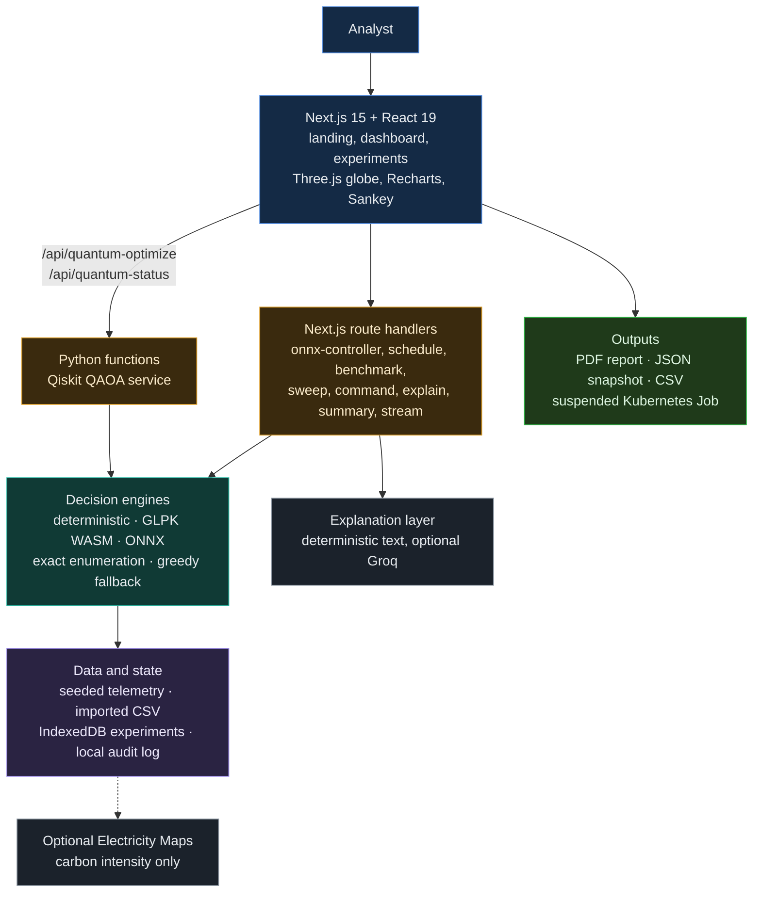
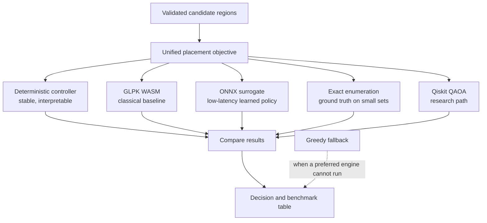
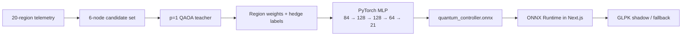
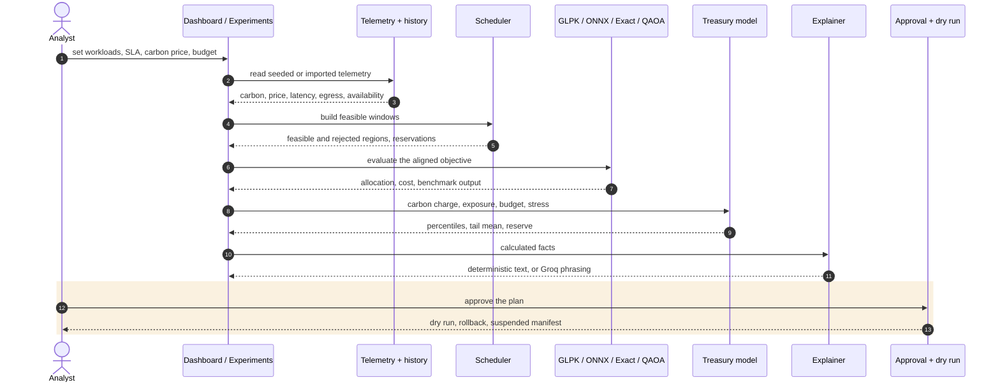
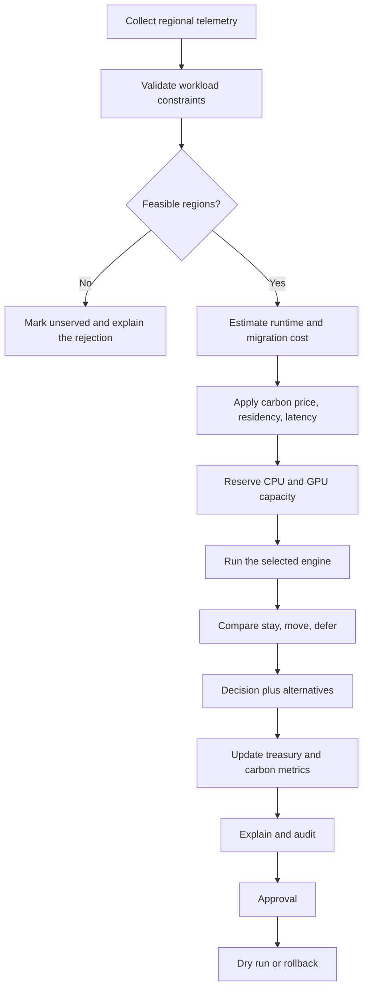
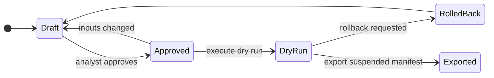
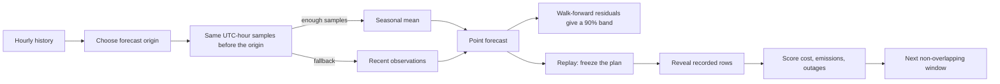
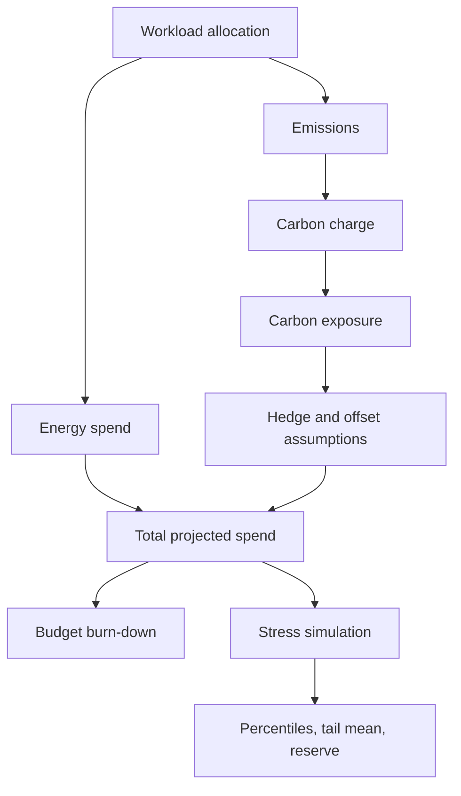

<p align="center">
  
</p>

<h3 align="center">Where should a workload run, when should it run, and what does that decision cost in money and carbon?</h3>

<p align="center">
  
  
  
  
  
  
  
  
  <a href="LICENSE"></a>
</p>

<p align="center">
  <a href="https://youtu.be/Gf04hdDypS4?si=m1yQPGEKX6m6EvX_"></a>
  &nbsp;
  <a href="https://carbon-ledger-ochre.vercel.app/"></a>
  &nbsp;
  <a href="VALIDATION.md"></a>
</p>

> **Carbon Ledger is not another cloud dashboard. It is one controller that treats carbon, cost, latency, residency and treasury risk as a single decision.**
> Twenty cloud regions, five decision engines (a deterministic controller, GLPK, ONNX, exact enumeration and Qiskit QAOA) and one aligned objective. Every move is explained, stress-tested against carbon and energy shocks, and walked through
> **draft, approval, dry run and rollback** before anything could ever run. The default demo needs no database, no paid API and no cloud account.

## Contents

1. [Context and overview](#1-context-and-overview): [pitch](#11-elevator-pitch-and-value-proposition) · [badges](#12-badges-and-status-indicators) · [screenshots and media](#13-demo-screenshots-and-media)
2. [Architecture and system design](#2-architecture-and-system-design): [diagrams](#21-architecture-diagrams) · [execution flow](#22-end-to-end-execution-flow) · [documentation](#23-documentation-links)
3. [Installation and configuration](#3-installation-and-configuration): [prerequisites](#31-prerequisites-and-tech-stack) · [install](#32-step-by-step-installation) · [environment](#33-environment-variables-matrix)
4. [Developer experience and quality control](#4-developer-experience-and-quality-control): [usage](#41-usage-snippets) · [testing](#42-testing-and-qa-commands)
5. [Reliability, performance and security](#5-reliability-performance-and-security): [validation](#51-validation-and-maturity-status) · [troubleshooting](#52-troubleshooting-and-known-limitations) · [security](#53-security-and-safety-model)
6. [Governance and license](#6-governance-and-license)

---

## 1. Context and overview

### 1.1 Elevator pitch and value proposition

**The problem.** Infrastructure placement is a multi-objective decision, but most teams look at it through separate tools. That produces three familiar failures.

<table>
<tr>
<td width="33%" valign="top">

**Cheap is not clean.**<br>
A region can be inexpensive and carbon-heavy. A low-carbon region can have poor latency. Optimising one number quietly worsens the others.

</td>
<td width="33%" valign="top">

**Moving is not free.**<br>
A migration can save runtime energy and still lose money to egress charges, transfer energy and downtime. Residency rules can block it altogether.

</td>
<td width="33%" valign="top">

**Savings are easy to overclaim.**<br>
Plans that leave jobs unserved look cheaper. Forecasts that peek at the future look accurate. Neither survives a careful review.

</td>
</tr>
</table>

**The answer.** Carbon Ledger puts all of it into one reproducible controller: it forecasts from past-only data, optimises on a single objective, explains every rejected region, prices the carbon exposure, stress-tests the plan, and withholds any savings claim whose comparison is invalid.

**Who it is for.** Platform and FinOps teams weighing carbon against cost, sustainability leads who need numbers they can defend, researchers comparing classical and quantum solvers on equal terms, and anyone studying carbon-aware scheduling without needing live cloud access.

**Core features**

| | Feature | What makes it different |
|---|---|---|
| Control | **20-region controller** | carbon intensity, energy price, latency, availability and egress for 20 AWS and GCP regions, on a 3D globe with a time scrubber |
| Engines | **Five engines, one objective** | deterministic controller, GLPK (WebAssembly), ONNX surrogate, exact enumeration and Qiskit QAOA, compared on the same candidates |
| Quantum | **A bounded QAOA path** | up to six strictly eligible candidates, run locally or serverless, benchmarked against exact enumeration; never presented as a proven advantage |
| Scheduling | **Realistic jobs** | durations, CPU and GPU capacity, dependencies, earliest start, deadlines, latency limits and India-only residency |
| Economics | **Migration break-even** | stay, move or defer, with egress, transfer energy, bandwidth, startup, downtime and break-even runtime |
| Forecasting | **Past-only forecasts** | seasonal forecasts with empirical 90% bands and walk-forward accuracy; no future leakage |
| Replay | **Historical replay** | plan from earlier data, freeze, reveal the recorded future, score realized cost, emissions and outages |
| Treasury | **Carbon as a balance sheet item** | carbon charge, offsets, hedge assumptions, budget burn-down, Sankey flows, correlated stress shocks, tail-mean and liquidity reserve |
| Explainability | **Facts first, words second** | cost breakdowns and rejected regions come from the calculation; Groq may phrase them, but never changes them |
| Safety | **Dry-run only** | draft, approval, dry run, rollback; any input change invalidates approval; Kubernetes exports are suspended Jobs |
| Reproducibility | **Seeded and portable** | 168 h of synthetic telemetry seeded with 42; experiments saved in IndexedDB and exported as JSON, CSV and PDF |
| Cost | **Local first** | the core workflow needs no paid API; Groq and Electricity Maps are optional |

### 1.2 Badges and status indicators

| Badge | Source |
|---|---|
| Tests | `npm test` (63 Node tests, including real native ONNX inference and the GLPK WASM solver) and `python -m pytest tests/test_quantum.py` (2 tests, real Qiskit Statevector run); recorded in [`VALIDATION.md`](VALIDATION.md) |
| Types | `npm run typecheck` (`tsc --noEmit`) |
| Lint | `npm run lint` (ESLint) |
| Build | `npm run build` (Next.js production build) |
| Stack | Next.js 15, React 19, Node >= 22.13, Python 3.12+, Qiskit 2.5.2 |
| Status | Simulation and experimentation platform: see section [5.1](#51-validation-and-maturity-status) |
| License | [MIT](LICENSE): see section [6](#6-governance-and-license) |

### 1.3 Demo screenshots and media

**Videos and site:** [the YouTube demo](https://youtu.be/Gf04hdDypS4?si=m1yQPGEKX6m6EvX_) · [the live website](https://carbon-ledger-ochre.vercel.app/)

**Three routes, one controller.**

| Route | Purpose |
|---|---|
| `/` | landing page, platform introduction, launch points |
| `/dashboard` | the live-style operational controller |
| `/experiments` | the research workspace: nine sections for workloads, decisions, replay, forecasts, benchmarks, treasury, experiments and execution |

<!-- TODO: add screenshots to docs/readme/screens/ and the tables below will render them. -->
<table>
<tr>
<td width="50%" valign="top"><br><b>The dashboard</b> (<code>/dashboard</code>): a 3D globe of the 20 regions, telemetry charts, a decision feed and a time scrubber. Inject a Mumbai heatwave, a Frankfurt wind surge, a Virginia outage or a carbon tax doubling and watch the controller react.</td>
<td width="50%" valign="top"><br><b>The experiment workspace</b> (<code>/experiments</code>): Overview, Workloads, Decisions, Replay, Forecasts, Benchmarks, Treasury, Experiments and Execution.</td>
</tr>
<tr>
<td valign="top"><br><b>The engine benchmark.</b> GLPK, exact enumeration, ONNX and Qiskit QAOA solve the same small candidate set under the same objective, side by side.</td>
<td valign="top"><br><b>Treasury and stress tests.</b> Budget burn-down, a Sankey of spend and carbon, and seeded correlated shocks with percentiles, tail mean and liquidity reserve.</td>
</tr>
</table>

**A decision, end to end.** Pick a workload, set the SLA, carbon price and budget, and the controller answers three questions in order: *what is feasible*, *what is cheapest among the feasible*, and *is moving actually worth it*.

<table>
<tr>
<td width="33%" valign="top"><b>1. Constraints first.</b> Residency, latency, capacity, deadlines and availability remove regions. Each removal carries a reason, so a rejected region is explained, not hidden.</td>
<td width="33%" valign="top"><b>2. One objective, many engines.</b> The feasible set is scored by the chosen engine. Cost includes energy, carbon charge, egress, transfer energy and downtime.</td>
<td width="33%" valign="top"><b>3. A person decides.</b> The plan is approved, dry-run and exportable as a suspended Kubernetes Job. Change any input and the approval is invalidated.</td>
</tr>
</table>

---

## 2. Architecture and system design

### 2.1 Architecture diagrams

**System layers** (every box is a folder you can open in this repository):



| Folder | Responsibility | Talks to |
|---|---|---|
| [`app/`](app) | the three pages and every Next.js API route | `components/`, `lib/` |
| [`components/`](components) | the globe, charts, benchmark lab, allocation editor, command bar, event injector, drift monitor, treasury Sankey | `lib/` |
| [`lib/`](lib) | the domain logic: controller math, optimizer, scheduler, forecast, finance, residency, validation, decision log, Groq adapter | pure TypeScript, no UI |
| [`lib/lab/`](lib/lab) | the experiment engine: scheduling, replay, analytics, report generation, persistence | `lib/` |
| [`python_quantum/`](python_quantum) · [`api/`](api) | the QAOA service and its serverless entry points | Qiskit |
| [`qiskit_train/`](qiskit_train) | offline QAOA reference, label generation and surrogate training | Qiskit, PyTorch |
| [`public/models/`](public/models) | the bundled `quantum_controller.onnx` surrogate | ONNX Runtime |
| [`scripts/`](scripts) | the local Qiskit server, a CLI, the ONNX builder | Python |

**The optimization engines**, all fed by one validated candidate set and one objective:



The benchmark isolates expected placement cost:

```text
energy_price / 1000  +  carbon_tax × 0.25 × carbon_ci / 1000  +  egress_cost_gb × 0.05
```

> QAOA circuit penalty energy is **not** treated as the business placement cost. The app keeps circuit energy and placement cost separate, so quantum and classical results are compared fairly.

**The ONNX surrogate** (see [`qiskit_train/artifacts/training_manifest.json`](qiskit_train/artifacts/training_manifest.json)):



The production app has no Python runtime dependency for the ONNX path. Python and Qiskit are an offline training and validation tier, plus an optional live QAOA path.

### 2.2 End-to-end execution flow

**From telemetry to an approved dry run:**



**The controller's logic at a glance:**



**Approval and execution safety:**



**Forecasting and replay, with no future leakage:**



**Treasury view:**



The scheduling cost model, conceptually:

```text
Total cost = runtime energy + transfer / egress + transfer energy + downtime + carbon charge
```

Carbon charge is the emitted kilograms of CO₂ multiplied by the selected carbon price.

### 2.3 Documentation links

| Document | What it covers |
|---|---|
| [`VALIDATION.md`](VALIDATION.md) | what was tested, in which environment, the fixes it surfaced and the stated boundaries |
| [`qiskit_train/README.md`](qiskit_train/README.md) | the Qiskit, PyTorch and ONNX training tier |
| [`qiskit_train/artifacts/training_manifest.json`](qiskit_train/artifacts/training_manifest.json) | model version, architecture, seed, error metrics and checksum |
| [`.env.example`](.env.example) | every optional setting, with comments |
| [`vercel.json`](vercel.json) | route rewrites and function time limits |
| [`lib/types.ts`](lib/types.ts) | the shared types behind every API |

**API map**

| Endpoint | Method | Purpose |
|---|---|---|
| `/api/onnx-controller` | `GET` / `POST` | telemetry and controller optimisation, ONNX and classical path |
| `/api/schedule` | `POST` | workload scheduling against telemetry and controls |
| `/api/benchmark` | `POST` | exact, GLPK, ONNX and quantum benchmark |
| `/api/sweep` | `POST` | SLA and carbon-tax parameter sweep for the heatmap |
| `/api/command` | `POST` | natural-language control commands, with a deterministic parser as fallback |
| `/api/explain` | `POST` | decision explanation, deterministic or Groq |
| `/api/summary` | `POST` | situation summary |
| `/api/stream` | `GET` | streaming telemetry updates |
| `/api/quantum-optimize` | `POST` | Qiskit QAOA (rewritten to `api/quantum_optimize.py` on Vercel) |
| `/api/quantum-status` | `GET` | Qiskit availability (rewritten to `api/quantum_status.py` on Vercel) |

POST-only routes are called by the app or an API client, not opened as browser pages.

---

## 3. Installation and configuration

### 3.1 Prerequisites and tech stack

| Requirement | Version | Notes |
|---|---|---|
| Node.js | **>= 22.13** | tested on Node 24.19; includes npm |
| Python | **>= 3.12** | only for the local or serverless Qiskit path and training; tested on 3.12 |
| Qiskit | **2.5.2** | pinned in `pyproject.toml`; `qiskit_train/requirements.txt` adds Aer, PyTorch, NumPy and SciPy |
| OS | Windows, macOS or Linux | `start.bat` and `start-local.bat` are Windows launchers |
| Optional: Groq key | none | natural-language commands and explanation phrasing |
| Optional: Electricity Maps key | none | live carbon intensity |
| Optional: Vercel | none | hosting, with the Python functions for Qiskit |

**Stack:** Next.js 15 (App Router) · React 19 · TypeScript · Tailwind CSS 3 · Zustand · Recharts · d3-sankey · Three.js with React Three Fiber and drei · Framer Motion · ONNX Runtime (Node) · glpk.js (WebAssembly) · Qiskit 2.5.2 · PyTorch (training only) · Groq (optional) · Electricity Maps (optional).

### 3.2 Step-by-step installation

**Windows, easiest path**

```text
1. Extract the project into a fresh folder.
2. Double-click start.bat and choose a mode:
     1  Full local stack (Next.js + Qiskit simulator)
     2  Next.js only
     3  Full Vercel local emulator
     4  Exit
3. Open http://localhost:3000
```

`start-local.bat` checks Node, npm and Python, installs dependencies, creates `qiskit_train/.venv`, copies `.env.example` to `.env.local` if missing, and starts Next.js with the local quantum bridge configured.

**Any OS, manual**

```bash
# 1. install (the flag skips the ONNX native download; the runtime install is CPU-only)
npm ci --onnxruntime-node-install=skip

# 2. run
npm run dev                      # http://localhost:3000

# 3. or a production build
npm run build && npm run start
```

<details>
<summary><b>Optional: the local Qiskit runtime (macOS and Linux)</b></summary>

```bash
python3 -m venv qiskit_train/.venv
qiskit_train/.venv/bin/python -m pip install -r requirements.txt
npm run quantum:python-check     # prints the Qiskit version
npm run dev
```

On Windows, `start-local.bat` does the same and also sets `QUANTUM_PYTHON_PATH` to the project virtual environment.
</details>

<details>
<summary><b>Optional: rebuild or retrain the surrogate model</b></summary>

```bash
npm run model:build              # rebuild the ONNX graph
npm run model:qaoa-labels        # generate QAOA labels with Qiskit
npm run model:train-qiskit       # train the surrogate from those labels
```

These are research commands. They are not needed to open the dashboard.
</details>

<details>
<summary><b>Optional: deploy to Vercel</b></summary>

1. Push the repository to GitHub, GitLab or Bitbucket.
2. Create a Vercel project and import it; keep the **Next.js** framework preset.
3. Add optional environment variables from section [3.3](#33-environment-variables-matrix).
4. Deploy.

`vercel.json` rewrites `/api/quantum-optimize` and `/api/quantum-status` to the Python functions and sets per-route time limits (the QAOA function gets 120 s). If the Python dependency bundle exceeds the standard function size, set `VERCEL_SUPPORT_LARGE_FUNCTIONS=1`; whether that is needed depends on the bundle and Vercel's current limits.

To try the same layout locally, run `start.bat` and choose option 3. That uses the Vercel CLI and does not deploy anything.
</details>

### 3.3 Environment variables matrix

Copy `.env.example` to `.env.local`. **Every variable is optional**: with none set, the app runs on seeded telemetry with deterministic explanations.

| Key | Description | Type | Default | Needed for |
|---|---|---|---|---|
| `ELECTRICITY_MAPS_API_KEY` | live grid carbon intensity; other metrics stay simulated | secret | empty | live carbon |
| `ELECTRICITY_MAPS_API_VERSION` | API version | string | `v4` | |
| `GROQ_API_KEY` | natural-language commands and explanation phrasing | secret | empty | Groq |
| `GROQ_MODEL` | chat model id | string | `openai/gpt-oss-20b` | |
| `GROQ_API_KEY_2` · `GROQ_MODEL_2` | backup key and its model (defaults to `GROQ_MODEL`) | secret · string | empty | |
| `GROQ_STRATEGY` | `failover`: primary first, backup on failure; `balance`: alternate keys per request | `failover \| balance` | `failover` | |
| `QUANTUM_MAX_CANDIDATES` | candidates passed to QAOA | int | `6` | quantum |
| `QUANTUM_PARAMETER_GRID` | size of the coarse parameter grid | int | `3` | quantum |
| `QUANTUM_SHOTS` | shots per circuit | int | `512` | quantum |
| `QUANTUM_ONE_HOT_PENALTY` | one-hot constraint penalty | float | `8.0` | quantum |
| `NEXT_PUBLIC_QUANTUM_LOCAL` | turns on the local Python bridge in the UI | string | empty | local Qiskit |
| `QUANTUM_LOCAL_PYTHON_URL` · `QUANTUM_LOCAL_PORT` | where the local bridge listens | URL · int | `http://127.0.0.1:8765` · `8765` | local Qiskit |
| `VERCEL_SUPPORT_LARGE_FUNCTIONS` | opt in to larger Python functions | `0 \| 1` | `0` | Vercel |

> Never commit real API keys. `.gitignore` already excludes `.env*` except `.env.example`. In production, set secrets in your host's environment settings.

---

## 4. Developer experience and quality control

### 4.1 Usage snippets

**Controls and events.** The dashboard exposes four controls: **SLA** (10 to 100 ms), **carbon tax** (0 to 1), **budget** (10 to 100 crore INR) and a **residency lock** (India-only placement). Four event presets stress the controller: *Mumbai heatwave*, *Frankfurt wind surge*, *Virginia outage* and *Carbon tax x2*. A **net-zero autopilot** glides the controls toward a target.

**Natural-language commands** (parsed by Groq when a key is set, by a deterministic parser otherwise). The parser understands phrases such as "India only", "greenest", "cheapest", "30 ms" and "60 crore":

```bash
curl -s -X POST http://localhost:3000/api/command \
     -H 'content-type: application/json' \
     -d '{"text":"India only, greenest routing, 30 ms, 60 crore budget"}'
# -> {"controls":{"dpdp_locked":true,"carbon_tax":0.95,"sla_ms":30,"budget_cr":60}, ...}
```

**The engine benchmark** is served by `POST /api/benchmark`. The Benchmarks tab in `/experiments` builds the request from the current controls and telemetry, takes up to six strictly feasible candidates, and returns one row per engine with its weights, cost, gap to the exact optimum and timing.

**Import your own history** (CSV, up to 744 contiguous hourly snapshots, all 20 regions per hour):

```text
timestamp,region,carbon_ci,energy_price,latency_ms,egress_cost_gb,available,source
```

| Field | Unit |
|---|---|
| `timestamp` | UTC hourly timestamp, unique per hour |
| `region` | catalog region code, e.g. `ap-south-1` |
| `carbon_ci` | gCO₂/kWh |
| `energy_price` | USD/MWh |
| `latency_ms` | milliseconds |
| `egress_cost_gb` | USD/GB |
| `available` | boolean |
| `source` | `mock`, `electricity-maps` or `stale` |

**Use the engines from TypeScript** (see [`lib/`](lib)):

```ts
import { demoHistory, defaultInput, compare } from "@/lib/lab/engine";

const input = defaultInput();            // seeded jobs, controls and migration settings
const result = compare(input);           // baseline vs optimised, same jobs, same horizon
// Savings are withheld when either plan leaves a required job unserved.
```

**Reproduce the QAOA path** on your machine:

```bash
python -m qiskit_train.qiskit_qaoa --samples 32
python scripts/check_quantum_local.py         # is the local bridge healthy?
# scripts/quantum_cli.py reads a JSON request on stdin; the app calls it per request in local mode
```

### 4.2 Testing and QA commands

| What | Command |
|---|---|
| Node unit and integration tests (63) | `npm test` |
| Python quantum tests (2) | `python -m pytest tests/test_quantum.py` |
| Type check | `npm run typecheck` |
| Lint | `npm run lint` |
| Production build | `npm run build` |
| Is Qiskit importable? | `npm run quantum:python-check` |

| Test file | What it covers |
|---|---|
| `controller.test.ts` | controller math and allocation |
| `lab.test.ts` · `v2.test.ts` | scheduling, replay, analytics, approval transitions |
| `native-engines.test.ts` | real native ONNX inference and the GLPK WASM solver |
| `qaoa-pipeline.test.ts` · `quantum-local.test.ts` · `quantum-live.test.ts` | the QAOA pipeline and the local and live quantum clients |
| `override.test.ts` | manual allocation overrides |
| `situation.test.ts` | situation summaries |
| `groq.test.ts` | the Groq adapter and its fallbacks |
| `test_quantum.py` | a real Qiskit Statevector run |

---

## 5. Reliability, performance and security

### 5.1 Validation and maturity status

Recorded in [`VALIDATION.md`](VALIDATION.md) against Node 24.19, Next.js 15.5.27, Python 3.12 and Qiskit 2.5.2.

| Check | Result |
|---|---|
| Node tests | 63 passing |
| Python quantum tests | 2 passing, real Qiskit Statevector |
| Type check, lint, production build | passing |
| Production API checks | HTTP 200 for `/`, `/experiments`, the ONNX controller, the benchmark API, the deterministic explanation fallback and local quantum optimisation |
| Browser checks (Chromium) | all nine experiment sections open; IndexedDB survives a reload; approval, dry run and rollback transition correctly; PDF and JSON downloads work; explanation fallback renders without Groq; GLPK, exact, ONNX and Qiskit results render in the benchmark table |
| Mobile | no horizontal page overflow at a 390 px viewport |
| Report PDF | parsed and rendered; searchable text and automatic pagination |

| Area | Status |
|---|---|
| Controller, scheduler, forecasting, replay, treasury | working and tested on seeded data |
| Engine benchmark (GLPK, exact, ONNX, QAOA) | working; QAOA limited to a small candidate set by design |
| Approval and dry-run workflow | working; no live execution exists |
| Groq and Electricity Maps | implemented with fallbacks; **not** exercised with real accounts |
| Vercel hosting and Windows launchers | **not** exercised in the validation environment |
| Real telemetry | the default dataset is synthetic |

### 5.2 Troubleshooting and known limitations

| Symptom | Cause | Fix or workaround |
|---|---|---|
| `node` or `npm` is not recognised | Node is missing or the terminal predates its install | install Node 22.13 or newer, restart the terminal, check `node --version` |
| Qiskit cannot be imported | the project virtual environment is missing or incomplete | `qiskit_train/.venv/bin/python -m pip install -r requirements.txt` (Windows: `qiskit_train\.venv\Scripts\python.exe`) |
| Quantum buttons do nothing in Next.js-only mode | the local Qiskit bridge is not configured | use `start.bat` option 1, or `start-local.bat` |
| Groq features read like templated text | no `GROQ_API_KEY` | intended: the deterministic fallback is used. Add a key to enable Groq phrasing |
| Electricity data still looks simulated | the key only supplies carbon intensity | price, latency, egress and capacity are not made live by that key |
| Odd behaviour after replacing project files | stale `.next` or `node_modules` | `rm -rf .next node_modules`, then `npm ci --onnxruntime-node-install=skip` (PowerShell: `Remove-Item -Recurse -Force .next, node_modules`) |
| Port 3000 is already in use | another process holds it | `npm run dev -- -p 3001` |
| Vercel Python function too large | the Qiskit bundle exceeds the standard limit | set `VERCEL_SUPPORT_LARGE_FUNCTIONS=1` |

**Technical trade-offs and boundaries**
- **QAOA is a research path, not a production claim.** Simulation cost grows quickly with problem size, so the app limits it to six strictly eligible candidates and compares it against exact enumeration.
- **The bundled ONNX model was trained from an encoded p=1 QAOA reference teacher**, not from live Qiskit labels, because the build environment could not download Qiskit. `qiskit_train/qiskit_qaoa.py` is the real Qiskit reproduction path, and `training_manifest.json` records the distinction.
- **Default data is synthetic**: 168 hours, seeded with 42. It is never presented as a live market or historical dataset.
- **Savings are withheld, not estimated,** whenever a baseline or optimised plan leaves required workloads unserved.
- **Not modelled:** compute and storage rental prices, embodied hardware emissions, monetary penalties for every service failure, source-side network contention, and globally optimal job-shop scheduling.
- **The audit log is local** and useful for reproducibility. It is not claimed to be tamper-proof.

### 5.3 Security and safety model

The security model in one breath: nothing executes for real, because the execution path is a **dry run**; approval is explicit and is invalidated by any input change; Kubernetes output is a **suspended** Job; secrets live in `.env.local` or the host's settings and never in the repository; and every number a Groq explanation mentions is computed first and passed in as fact.

To report a vulnerability, please contact the maintainers **privately** rather than opening a public issue. <!-- TODO: add your contact email or enable GitHub private vulnerability reporting and link it here. -->

---

## 6. Governance and license

**License.** Carbon Ledger is open source under the [MIT License](LICENSE).

**Contributing.** Branch from `main`, then run the full gate before every push:

```bash
git checkout -b feature/your-change
npm ci --onnxruntime-node-install=skip
npm run typecheck && npm run lint && npm test && npm run build
```

If a change touches optimisation logic, say in the pull request whether it alters the **objective coefficients**, **candidate feasibility rules**, **scheduling semantics**, **carbon accounting**, **benchmark comparability**, **forecast leakage rules** or **approval and execution safety**.

**Roadmap**

- [ ] Authenticated multi-user workspaces and cloud-synced experiment history
- [ ] Real cloud price ingestion and live latency measurement
- [ ] A richer compute and storage pricing model
- [ ] Multi-objective Pareto controls
- [ ] Larger quantum experiments on remote backends
- [ ] Per-lead-time forecast calibration
- [ ] Cryptographically chained audit records and signed execution manifests
- [ ] Kubernetes integration behind explicit safety controls
- [ ] More scenario presets for carbon shocks and regional outages

**Team.** <!-- TODO: add your name and teammates here. -->

<p>
  
  
  
  
  
  
  
  
  
</p>

<p align="center"><sub>Carbon Ledger: observe, forecast, optimise, explain, approve, dry-run, measure.</sub></p>
