# 🌍 Carbon Ledger

## Dual-Engine Carbon & Treasury Controller

**A simulation-driven control plane for carbon-aware, cost-aware, compliance-aware workload placement across 20 cloud regions, with classical optimization, ONNX inference, Qiskit QAOA, treasury modeling, forecasting, replay, explainability, and safe dry-run execution.**

### Quick Navigation

[Overview](#overview) · [Architecture](#system-architecture) · [Features](#core-features) · [Quantum Engine](#quantum-optimization-path) · [Treasury](#treasury--stress-testing) · [API Map](#api-map) · [Repository Structure](#repository-structure) · [Quick Start](#quick-start) · [Testing](#validation--testing)

---

## Table of Contents

1. [Overview](#overview)
2. [Why Carbon Ledger](#why-carbon-ledger)
3. [Application Routes](#application-routes)
4. [System Architecture](#system-architecture)
5. [End-to-End Decision Flow](#end-to-end-decision-flow)
6. [Core Features](#core-features)
7. [Experiment Workspace](#experiment-workspace)
8. [Optimization Engines](#optimization-engines)
9. [Quantum Optimization Path](#quantum-optimization-path)
10. [Forecasting & Historical Replay](#forecasting--historical-replay)
11. [Treasury & Stress Testing](#treasury--stress-testing)
12. [Data & Accounting Model](#data--accounting-model)
13. [Approval & Execution Safety](#approval--execution-safety)
14. [API Map](#api-map)
15. [Repository Structure](#repository-structure)
16. [Quick Start](#quick-start)
17. [Environment Variables](#environment-variables)
18. [Local Qiskit Runtime](#local-qiskit-runtime)
19. [Deployment](#deployment)
20. [Validation & Testing](#validation--testing)
21. [Troubleshooting](#troubleshooting)
22. [Model Boundaries](#model-boundaries)
23. [Roadmap](#roadmap)
24. [Route Reference](#route-reference)
25. [License](#license)

---

# Overview

**Carbon Ledger** is a carbon-aware workload-placement and treasury simulation platform built to answer a practical control question:

> **Where should a workload run, when should it run, and what financial / carbon consequences does that decision create?**

Instead of treating cloud placement, sustainability, treasury exposure, latency, migration cost, and compliance as separate dashboards, Carbon Ledger combines them into one reproducible controller.

The system evaluates workloads across **20 regions** using telemetry and scheduling constraints, then compares multiple decision engines:

- **Classical deterministic optimization**
- **GLPK linear optimization**
- **ONNX surrogate inference**
- **Qiskit QAOA quantum optimization**
- **Exact enumeration** for small benchmark candidate sets
- **Safe greedy fallback** when required

It also adds forecasting, historical replay, scenario comparison, migration break-even analysis, treasury stress testing, explainability, approval states, audit trails, and exportable reports.

> [Back to top](#carbon-ledger)

---

# Why Carbon Ledger

Modern infrastructure decisions are multi-objective. A region can be inexpensive but carbon-intensive. A low-carbon region may have poor latency. A workload may be movable technically but blocked by residency requirements. A migration may save runtime energy while losing money through transfer cost and downtime.

Carbon Ledger models these conflicts explicitly.

```mermaid
flowchart TB
    CL[Carbon Ledger] --> C[Carbon]
    CL --> COST[Cost]
    CL --> PERF[Performance]
    CL --> INTEL[Intelligence]
    CL --> RISK[Risk]
    CL --> REP[Reproducibility]

    C --> C1[Regional carbon intensity]
    C --> C2[Carbon charge]
    C --> C3[Emission-aware placement]

    COST --> K1[Energy price]
    COST --> K2[Egress and transfer cost]
    COST --> K3[Downtime cost]

    PERF --> P1[Latency constraints]
    PERF --> P2[CPU and GPU capacity]
    PERF --> P3[Deadlines and dependencies]

    INTEL --> I1[ONNX inference]
    INTEL --> I2[Classical optimization]
    INTEL --> I3[QAOA]
    INTEL --> I4[Groq explanation layer]

    RISK --> R1[Stress testing]
    RISK --> R2[Historical replay]
    RISK --> R3[Approval and rollback]

    REP --> X1[Seeded simulation]
    REP --> X2[CSV and JSON exports]
    REP --> X3[Saved experiments]
```

### Key design principles

| Principle | Meaning in Carbon Ledger |
|---|---|
| **Comparable engines** | Quantum, ONNX, GLPK and exact methods are evaluated on aligned placement objectives. |
| **No silent dropped workloads** | Savings are withheld when a comparison is invalid because jobs remain unserved. |
| **Reproducible first** | Default telemetry is deterministic and seeded; experiments can be exported/imported. |
| **Explain constraints** | Rejected regions and migration choices are surfaced rather than hidden. |
| **Local-first demo** | Core workflows run without paid APIs. |
| **Safe execution model** | The execution workflow remains dry-run oriented with explicit approval and rollback. |

> [Back to top](#carbon-ledger)

---

# Application Routes

The project includes three primary user-facing routes.

| Route | Purpose | Local Redirect |
|---|---|---|
| `/` | Landing page, platform introduction and launch points | `http://localhost:3000/` |
| `/dashboard` | Live-style controller dashboard | `http://localhost:3000/dashboard` |
| `/experiments` | Detailed experiment, replay, benchmark and execution workspace | `http://localhost:3000/experiments` |

### Redirect flow

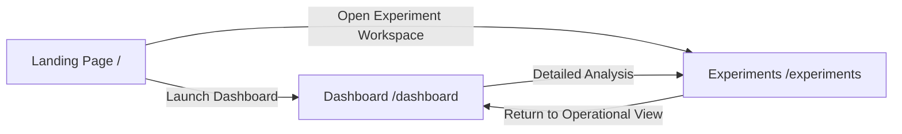

When deployed, use the same route paths on your production domain. For example, if your domain is `https://example.com`, the routes become `https://example.com/dashboard` and `https://example.com/experiments`.

> [Back to top](#carbon-ledger)

---

# System Architecture

```mermaid
flowchart TB
    U[User / Analyst] --> UI[Next.js 15 + React 19 Interface]

    subgraph FRONTEND[Frontend Control Plane]
      L[Landing]
      D[Dashboard]
      E[Experiment Workspace]
      C3D[Three.js / React Three Fiber]
      CH[Charts / Sankey / Heatmaps]
    end

    UI --> FRONTEND

    FRONTEND --> API[Next.js API Layer]

    subgraph API_LAYER[Application APIs]
      A1[/api/onnx-controller]
      A2[/api/schedule]
      A3[/api/benchmark]
      A4[/api/sweep]
      A5[/api/command]
      A6[/api/explain]
      A7[/api/summary]
      A8[/api/stream]
    end

    API --> API_LAYER

    subgraph ENGINES[Decision Engines]
      GLPK[GLPK WASM Solver]
      ONNX[ONNX Runtime Model]
      OPT[Deterministic Optimizer]
      EXACT[Exact Enumeration]
      QAOA[Qiskit QAOA]
      FALLBACK[Greedy Fallback]
    end

    API_LAYER --> ENGINES

    subgraph DATA[Data + State]
      MOCK[Seeded Synthetic Telemetry]
      CSV[Imported Historical CSV]
      IDB[IndexedDB Experiments]
      LOCAL[Local Audit / Decision Log]
      FEED[Optional Electricity Maps]
    end

    ENGINES --> DATA
    DATA --> API_LAYER

    subgraph AI[Communication / Explanation]
      GROQ[Groq Optional]
      DET[Deterministic Parser / Explanation]
    end

    API_LAYER --> AI

    subgraph OUTPUTS[Outputs]
      PDF[PDF Report]
      JSON[Portable JSON Snapshot]
      CSVOUT[CSV Exports]
      K8S[Suspended Kubernetes Job]
      AUDIT[Audit Trail]
    end

    FRONTEND --> OUTPUTS
```

### Architecture layers

1. **Presentation layer** — operational dashboard, experiments, 3D visuals and charts.
2. **Control/API layer** — validates requests and orchestrates controller logic.
3. **Optimization layer** — classical, ONNX, exact and QAOA solvers.
4. **Data layer** — mock/historical telemetry, browser experiment state and optional live carbon feed.
5. **Explanation layer** — deterministic explanations with optional Groq enhancement.
6. **Reporting/execution layer** — PDF/JSON/CSV exports and safe dry-run execution artifacts.

> [Back to top](#carbon-ledger)

---

# End-to-End Decision Flow

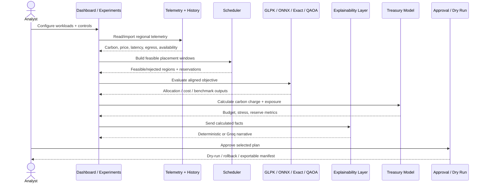

### Controller logic at a glance

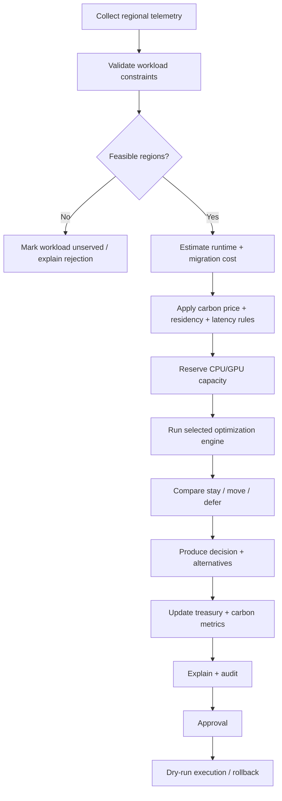

> [Back to top](#carbon-ledger)

---

# Core Features

| Feature | What it does |
|---|---|
| 🌐 **20-region controller** | Simulates regional placement using carbon, energy price, latency, availability and egress signals. |
| 🧠 **Multi-engine optimization** | Compares deterministic, GLPK, ONNX, exact and QAOA approaches. |
| ⚛️ **Qiskit QAOA** | Runs a quantum approximate optimization path over a bounded candidate set. |
| 📅 **Realistic scheduling** | Models duration, dependencies, CPU/GPU capacity, deadlines and earliest start. |
| 🧳 **Migration economics** | Accounts for transfer charge, transfer energy, downtime, bandwidth and startup delay. |
| 🇮🇳 **Residency-aware placement** | Supports India-only placement constraints globally or per workload. |
| 📈 **Forecasting** | Generates seasonal forecasts with residual-based uncertainty intervals. |
| ⏪ **Historical replay** | Plans from past-only observations then evaluates against realized data. |
| 🔥 **Stress testing** | Applies seeded correlated carbon/energy shocks and calculates tail risk. |
| 💰 **Treasury view** | Links carbon exposure, offsets, budget and allocation decisions. |
| 🧾 **Explainability** | Shows cost breakdowns, rejected regions and best feasible alternatives. |
| 🤖 **Groq-enhanced narratives** | Optional natural-language explanation while keeping calculations authoritative. |
| 🧪 **Engine benchmark lab** | Tests GLPK, exact, ONNX and QAOA on the same candidate set and objective. |
| 🗂️ **Saved experiments** | Uses browser IndexedDB plus portable JSON export/import. |
| 📄 **Report export** | Creates experiment/report artifacts including assumptions and audit context. |
| 🛡️ **Approval workflow** | Draft → approval → dry-run → rollback with input-change invalidation. |
| ☸️ **Execution artifact export** | Produces suspended Kubernetes Job representations instead of silently deploying live compute. |

> [Back to top](#carbon-ledger)

---

# Experiment Workspace

The `/experiments` route is the detailed research/analysis area of Carbon Ledger.

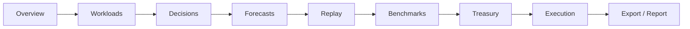

### Major experiment capabilities

#### 1. Baseline savings dashboard
Compares baseline and optimized plans over the same workloads and horizon. Energy, carbon charge, transfer and downtime costs are included. Savings are not asserted if either plan leaves required workloads unserved.

#### 2. Realistic scheduling
Each job can include:

- Runtime duration
- CPU requirements
- GPU requirements
- Dependency graph
- Earliest start
- Completion deadline
- Maximum latency
- India-only residency constraint

#### 3. Migration break-even analysis
A move is evaluated against staying in place. The model includes:

- Source egress charges
- Transfer bandwidth
- Transfer energy/emissions
- Startup time
- Downtime
- Destination runtime economics
- Break-even runtime

#### 4. Historical replay
Replay deliberately avoids future leakage by using only data that existed before each simulated planning window.

#### 5. Explainable decisions
Decisions expose:

- Selected region
- Estimated total cost
- Carbon component
- Transfer component
- Feasible alternatives
- Rejected regions with reasons
- Optional Groq explanation based on calculated facts

#### 6. Fair engine benchmark
Exact enumeration, GLPK, ONNX and QAOA operate on the same small candidate set and aligned placement objective.

#### 7. Forecast accuracy
Walk-forward scoring measures forecast error and empirical interval coverage.

#### 8. Treasury stress tests
Seeded correlated shocks produce reproducible cost distributions, liquidity metrics and tail-risk statistics.

#### 9. Saved experiments + report generation
Experiments can be saved locally, exported as portable JSON, restored later, and summarized through report exports.

#### 10. Approval and execution
A selected plan must move through explicit stages rather than automatically executing.

> [Back to top](#carbon-ledger)

---

# Optimization Engines

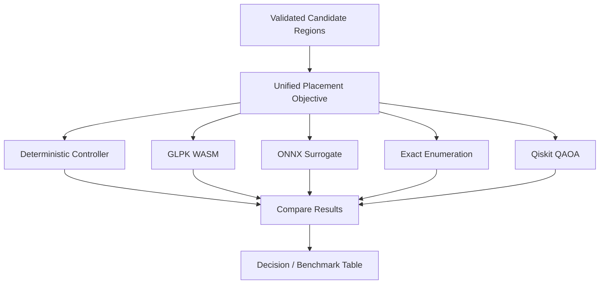

### Engine roles

| Engine | Role | Strength |
|---|---|---|
| Deterministic optimizer | Primary application controller logic | Stable and interpretable |
| GLPK WASM | Classical mathematical optimization | Exact classical baseline for supported formulation |
| ONNX Runtime | Fast learned/surrogate policy inference | Low-latency model path |
| Exact enumeration | Small-candidate reference | Useful benchmark ground truth |
| Qiskit QAOA | Quantum approximate optimization | Research/benchmark path |
| Greedy fallback | Reliability layer | Keeps workflows usable when a preferred engine cannot run |

### Benchmark objective

The v5 benchmark isolates expected placement cost using:

```text
energy_price / 1000
+ carbon_tax × 0.25 × carbon_ci / 1000
+ egress_cost_gb × 0.05
```

The benchmark selects up to six strictly eligible candidates and compares solver outputs under aligned candidate weights and constraints.

> **Important:** QAOA circuit penalty energy is not treated as the final business placement cost. The application separates circuit optimization energy from the actual placement objective used for comparison.

> [Back to top](#carbon-ledger)

---

# Quantum Optimization Path

The project contains both local and serverless-style Qiskit integration paths.

```mermaid
flowchart LR
    UI[Dashboard / Benchmark] --> QC[Quantum Client]
    QC --> MODE{Runtime mode}
    MODE -->|Local| PY[Per-request Python process]
    MODE -->|Serverless / Vercel| VAPI[/api/quantum-optimize]
    PY --> QAOA[Qiskit QAOA]
    VAPI --> QAOA
    QAOA --> RES[Candidate probabilities + solution]
    RES --> UI
```

### Relevant quantum files

```text
qiskit_train/
├── qaoa_reference.py
├── qiskit_qaoa.py
├── train_surrogate.py
├── requirements.txt
└── artifacts/

python_quantum/
└── qaoa_service.py

api/
├── quantum_optimize.py
└── quantum_status.py

scripts/
├── check_quantum_local.py
├── local_quantum_server.py
└── quantum_cli.py
```

### Default Qiskit tuning controls

```env
QUANTUM_MAX_CANDIDATES=6
QUANTUM_PARAMETER_GRID=3
QUANTUM_SHOTS=512
QUANTUM_ONE_HOT_PENALTY=8.0
```

### Why a bounded candidate set?

QAOA simulation cost increases rapidly with problem size. The application therefore restricts quantum benchmarking to a small number of strictly eligible candidates and uses it as a comparative research path rather than pretending it is a proven production advantage.

> [Back to top](#carbon-ledger)

---

# Forecasting & Historical Replay

### Forecast flow

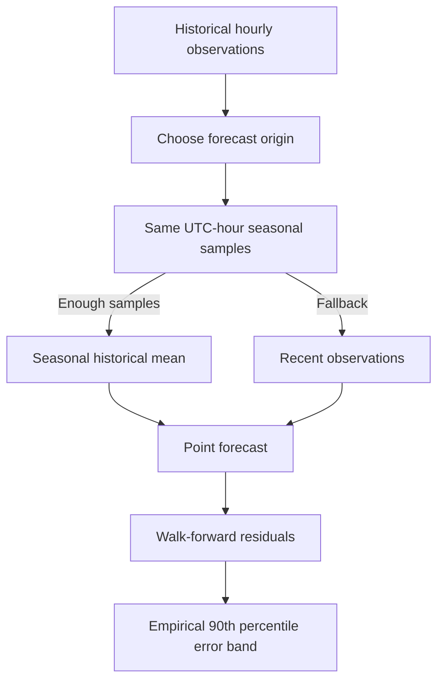

The forecasting logic uses only observations strictly before the forecast origin. Availability and latency are carried from the last known observations; future outages are not assumed to be known.

### Replay flow

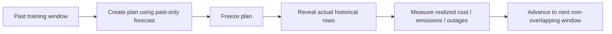

Historical replay is especially useful for asking:

- Would the controller have saved money using only information available at the time?
- Did the plan expose workloads to actual outages?
- Did latency/SLA constraints fail in reality?
- Did a forecast error materially change the decision?

> [Back to top](#carbon-ledger)

---

# Treasury & Stress Testing

Carbon Ledger treats infrastructure placement as a treasury problem as well as a scheduler problem.

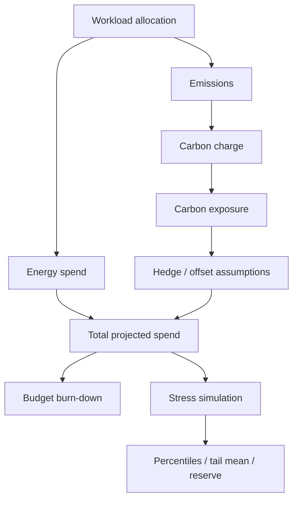

### Stress-test outputs can include

- Correlated energy-price shocks
- Correlated carbon-intensity shocks
- Hedge premium assumptions
- Carbon exposure
- Liquidity reserve
- Cost percentiles
- Tail-mean metrics
- Reproducible seeded runs
- CSV export

This makes it possible to test not only **"What is cheapest now?"** but also **"How fragile is this plan under adverse carbon and energy conditions?"**

> [Back to top](#carbon-ledger)

---

# Data & Accounting Model

## Default data

The bundled starting dataset is:

- **168 hours** of deterministic synthetic telemetry
- Seeded with **42**
- Clearly treated as simulation data
- Not represented as a live market or historical dataset

### Supported imported CSV columns

```text
timestamp,region,carbon_ci,energy_price,latency_ms,egress_cost_gb,available,source
```

### Expected units

| Field | Unit / Format |
|---|---|
| `timestamp` | UTC hourly timestamp |
| `region` | Catalog region code |
| `carbon_ci` | gCO₂/kWh |
| `energy_price` | USD/MWh |
| `latency_ms` | milliseconds |
| `egress_cost_gb` | USD/GB |
| `available` | boolean |
| `source` | `mock`, `electricity-maps`, or `stale` |

Each timestamp must represent a unique UTC hour with all 20 region codes. Imported hours must be contiguous. The project supports up to **744 hourly snapshots (31 days)** for the experiment import model described in v5.

## Scheduling cost model

Conceptually:

```text
Total Cost
= Runtime Energy Cost
+ Transfer / Egress Cost
+ Transfer Energy Cost
+ Downtime Cost
+ Carbon Charge
```

Carbon charge is calculated from emitted kilograms of CO₂ and the user-selected carbon price.

### Explicit exclusions / simplifications

The current model does **not** claim to fully model:

- Compute rental pricing
- Storage rental pricing
- Embodied hardware emissions
- Monetary penalties for every service failure
- Outgoing source network-capacity contention
- Full globally optimal job-shop scheduling

These boundaries are intentional and should be preserved in research claims.

> [Back to top](#carbon-ledger)

---

# Approval & Execution Safety

The project does not jump directly from recommendation to live action.

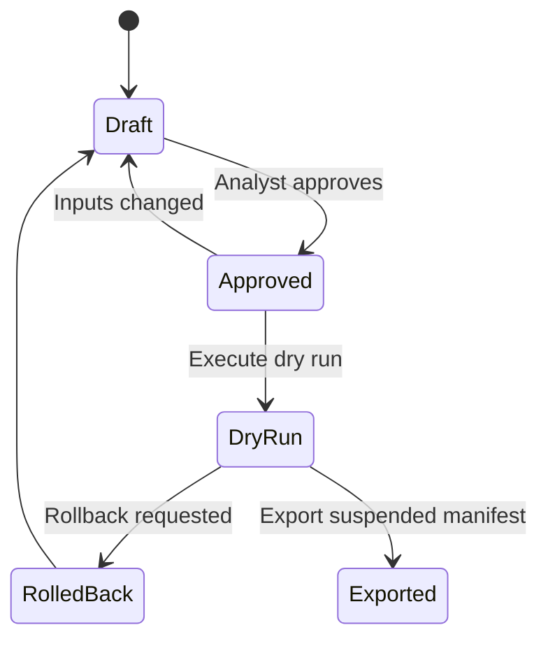

### Safety properties

- Input changes invalidate earlier approval.
- Execution is modeled as a **dry run**.
- Kubernetes exports can remain suspended rather than deploying active workloads automatically.
- Local audit records capture relevant decision activity.
- Audit data is useful for reproducibility but is **not claimed to be cryptographically tamper-proof**.

> [Back to top](#carbon-ledger)

---

# API Map

## Next.js API routes

| Endpoint | Method | Purpose |
|---|---|---|
| `/api/onnx-controller` | `GET` / `POST` | Telemetry/controller optimization and ONNX/classical path |
| `/api/schedule` | `POST` | Workload scheduling against telemetry and controls |
| `/api/benchmark` | `POST` | Compare exact, GLPK, ONNX and quantum-oriented benchmark data |
| `/api/sweep` | `POST` | Parameter sweep / heatmap cells |
| `/api/command` | `POST` | Natural-language control command parsing with deterministic fallback |
| `/api/explain` | `POST` | Decision explanation with deterministic fallback or Groq |
| `/api/summary` | `POST` | Situation summary / narrative generation |
| `/api/stream` | `GET` | Streaming telemetry-style updates |

## Python quantum routes

Vercel rewrites expose:

| Public Route | Backing Function |
|---|---|
| `/api/quantum-optimize` | `api/quantum_optimize.py` |
| `/api/quantum-status` | `api/quantum_status.py` |

### API topology

```mermaid
flowchart LR
    CLIENT[React Client] --> NAPI[Next.js Route Handlers]
    NAPI --> TS[TypeScript Controller Logic]
    NAPI --> GROQ[Optional Groq]
    NAPI --> ONNX[ONNX Runtime]
    NAPI --> GLPK[GLPK WASM]
    CLIENT --> QURL[/api/quantum-optimize]
    QURL --> PY[Python Qiskit Service]
    CLIENT --> QSTAT[/api/quantum-status]
    QSTAT --> PY
```

> [Back to top](#carbon-ledger)

---

# Repository Structure

```text
carbon-treasury-controller-v5/
│
├── app/                              # Next.js App Router
│   ├── page.tsx                      # Landing page
│   ├── layout.tsx                    # Root layout
│   ├── globals.css                   # Global styling
│   ├── dashboard/
│   │   └── page.tsx                  # Operational dashboard
│   ├── experiments/
│   │   └── page.tsx                  # Research / experiment workspace
│   └── api/
│       ├── benchmark/route.ts        # Solver benchmark API
│       ├── command/route.ts          # Natural-language commands
│       ├── explain/route.ts          # Decision explanations
│       ├── onnx-controller/route.ts  # Main controller API
│       ├── schedule/route.ts         # Workload scheduler API
│       ├── stream/route.ts           # Streaming telemetry API
│       ├── summary/route.ts          # Situation summary API
│       └── sweep/route.ts            # Parameter sweep API
│
├── api/                              # Python serverless quantum functions
│   ├── quantum_optimize.py
│   └── quantum_status.py
│
├── components/                       # UI and visualization components
│   ├── AllocationEditor.tsx
│   ├── BenchmarkLab.tsx
│   ├── BrandLogo.tsx
│   ├── BudgetBurnDown.tsx
│   ├── CommandBar.tsx
│   ├── ControlPanel.tsx
│   ├── ControllerDashboard.tsx
│   ├── DashboardHeader.tsx
│   ├── DecisionFeed.tsx
│   ├── DriftMonitor.tsx
│   ├── EngineRace.tsx
│   ├── EventInjector.tsx
│   ├── ExplainButton.tsx
│   ├── FrontierChart.tsx
│   ├── Globe3D.tsx
│   ├── MetricCard.tsx
│   ├── QuantumController.tsx
│   ├── RegionDrawer.tsx
│   ├── ScenarioCompare.tsx
│   ├── SweepHeatmap.tsx
│   ├── TelemetryChart.tsx
│   ├── TimeScrubber.tsx
│   ├── TreasurySankey.tsx
│   └── WorkloadTable.tsx
│
├── lib/                              # Core domain/controller logic
│   ├── anomaly.ts
│   ├── autopilot.ts
│   ├── classicalWasmSolver.ts        # GLPK WASM solver integration
│   ├── controllerClient.ts
│   ├── controllerMath.ts
│   ├── decisionLog.ts
│   ├── events.ts
│   ├── finance.ts
│   ├── forecast.ts
│   ├── groq.ts                       # Optional Groq integration
│   ├── mockData.ts                   # Deterministic synthetic telemetry
│   ├── monteCarlo.ts                 # Stress simulation support
│   ├── onnxInference.ts              # ONNX runtime path
│   ├── optimizer.ts
│   ├── override.ts
│   ├── quantumClient.ts
│   ├── quantumLocalServer.ts
│   ├── regions.ts
│   ├── residency.ts
│   ├── scheduler.ts
│   ├── simClock.ts
│   ├── situation.ts
│   ├── store.ts
│   ├── theme.ts
│   ├── types.ts
│   └── validation.ts
│
├── python_quantum/
│   ├── __init__.py
│   └── qaoa_service.py               # Quantum optimization service logic
│
├── qiskit_train/
│   ├── artifacts/
│   ├── qaoa_reference.py
│   ├── qiskit_qaoa.py
│   ├── train_surrogate.py
│   ├── requirements.txt
│   └── README.md
│
├── scripts/
│   ├── build_onnx_model.py
│   ├── check_quantum_local.py
│   ├── local_quantum_server.py
│   └── quantum_cli.py
│
├── public/
│   ├── brand/
│   └── models/                       # Bundled model assets
│
├── tests/
│   ├── controller.test.ts
│   ├── groq.test.ts
│   ├── lab.test.ts
│   ├── native-engines.test.ts
│   ├── override.test.ts
│   ├── qaoa-pipeline.test.ts
│   ├── quantum-live.test.ts
│   ├── quantum-local.test.ts
│   ├── situation.test.ts
│   ├── test_quantum.py
│   └── v2.test.ts
│
├── types/
│   └── glpk.d.ts
│
├── .env.example                     # Environment template
├── .eslintrc.json
├── .gitignore
├── next.config.ts
├── package.json
├── package-lock.json
├── postcss.config.mjs
├── pyproject.toml
├── requirements.txt
├── start.bat                        # Windows launcher menu
├── start-local.bat                  # Windows Next.js + local Qiskit launcher
├── tailwind.config.ts
├── tsconfig.json
├── VALIDATION.md
└── vercel.json
```

> [Back to top](#carbon-ledger)

---

# Quick Start

## Windows — easiest method

### Requirements

- **Node.js 22.13+**
- **Python 3.12+** recommended for local Qiskit mode
- npm

### Start

1. Extract the project ZIP into a fresh folder.
2. Open the extracted project folder.
3. Double-click:

```text
start.bat
```

4. Choose a mode:

```text
1. Full local stack (Next.js + Qiskit simulator)
2. Next.js only
3. Full Vercel local emulator
4. Exit
```

5. Open:

```text
http://localhost:3000
```

### Routes after launch

```text
http://localhost:3000/
http://localhost:3000/dashboard
http://localhost:3000/experiments
```

---

## Manual Node setup

```bash
npm ci --onnxruntime-node-install=skip
npm run dev
```

Then visit:

```text
http://localhost:3000
```

### Production build

```bash
npm run build
npm run start
```

### Type checking

```bash
npm run typecheck
```

### Lint

```bash
npm run lint
```

### Node tests

```bash
npm test
```

> [Back to top](#carbon-ledger)

---

# Environment Variables

Copy `.env.example` to `.env.local` when configuring optional integrations.

```bash
cp .env.example .env.local
```

Windows launchers can create `.env.local` automatically if it does not exist.

## Optional Electricity Maps configuration

```env
ELECTRICITY_MAPS_API_KEY=
ELECTRICITY_MAPS_API_VERSION=v4
```

Without this key, the application continues using its deterministic/simulated telemetry behavior.

## Optional Groq configuration

```env
GROQ_API_KEY=
GROQ_MODEL=openai/gpt-oss-20b

GROQ_API_KEY_2=
GROQ_MODEL_2=
GROQ_STRATEGY=failover
```

The system remains usable without Groq because command parsing and explanations include deterministic fallback logic.

### Strategy options

```text
failover  → primary key first, backup only when needed
balance   → alternate keys to distribute requests
```

## Quantum tuning

```env
QUANTUM_MAX_CANDIDATES=6
QUANTUM_PARAMETER_GRID=3
QUANTUM_SHOTS=512
QUANTUM_ONE_HOT_PENALTY=8.0
```

## Local quantum bridge variables

```env
NEXT_PUBLIC_QUANTUM_LOCAL=
QUANTUM_LOCAL_PYTHON_URL=http://127.0.0.1:8765
QUANTUM_LOCAL_PORT=8765
```

`start-local.bat` additionally sets `QUANTUM_PYTHON_PATH` to the project virtual environment automatically.

> ⚠️ Never commit real API keys to GitHub. Keep secrets in `.env.local` locally and in your deployment platform's environment-variable settings for production.

> [Back to top](#carbon-ledger)

---

# Local Qiskit Runtime

## Windows

Use:

```text
start-local.bat
```

The launcher will:

1. Verify Node.js/npm/Python.
2. Install Node dependencies if required.
3. Create `qiskit_train/.venv` if missing.
4. Install Python/Qiskit dependencies if required.
5. Create `.env.local` from `.env.example` if needed.
6. Set the local quantum environment variables.
7. Start Next.js.

## macOS / Linux

```bash
python3 -m venv qiskit_train/.venv
qiskit_train/.venv/bin/python -m pip install -r requirements.txt
npm ci --onnxruntime-node-install=skip
npm run dev
```

### Verify Qiskit

```bash
npm run quantum:python-check
```

or

```bash
python3 -c "import qiskit; print(qiskit.__version__)"
```

### Build/prepare model utilities

```bash
npm run model:build
npm run model:qaoa-labels
npm run model:train-qiskit
```

Use these research/training commands intentionally; they are not required just to open the standard dashboard.

> [Back to top](#carbon-ledger)

---

# Deployment

The repository contains `vercel.json` and is designed for a Vercel-compatible Next.js deployment model.

## Recommended deployment flow

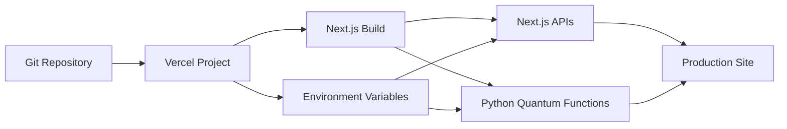

### Deploy through Vercel dashboard

1. Push the repository to GitHub/GitLab/Bitbucket.
2. Create a new Vercel project.
3. Import the repository.
4. Keep framework detection as **Next.js**.
5. Add optional environment variables only if needed.
6. Deploy.

### Local Vercel emulator

On Windows, run `start.bat` and choose:

```text
3. Full Vercel local emulator
```

This uses the Vercel CLI locally and does **not** automatically deploy your application.

### Route rewrites

`vercel.json` maps:

```text
/api/quantum-optimize → /api/quantum_optimize.py
/api/quantum-status   → /api/quantum_status.py
```

### Deployment note

The repository includes a `VERCEL_SUPPORT_LARGE_FUNCTIONS` setting for cases where Python dependency size requires a larger function package. Whether it is needed depends on the deployed dependency bundle and current Vercel platform limits.

> [Back to top](#carbon-ledger)

---

# Validation & Testing

The included `VALIDATION.md` records validation of the v5 project against a tested environment including Node, Next.js, Python and Qiskit.

Recorded checks include:

- **63 Node tests passing**
- **2 Python quantum tests passing** with real Qiskit Statevector execution
- TypeScript type checking passing
- ESLint passing
- Production build passing
- Production API checks returning HTTP 200 for key routes
- Browser navigation across experiment sections
- IndexedDB persistence across reload
- Approval → dry run → rollback workflow
- PDF and JSON downloads
- Deterministic explanation fallback without Groq
- GLPK, exact, ONNX and Qiskit benchmark rendering
- Mobile-width overflow validation

## Run tests yourself

### Node tests

```bash
npm test
```

### Type checking

```bash
npm run typecheck
```

### Lint

```bash
npm run lint
```

### Production build

```bash
npm run build
```

### Python tests

```bash
python -m pytest tests/test_quantum.py
```

Depending on your environment, install Python requirements first:

```bash
python -m pip install -r requirements.txt
```

> Passing tests validate exercised paths; they are not a guarantee against every future data, provider, platform or deployment failure.

> [Back to top](#carbon-ledger)

---

# Troubleshooting

## `node` or `npm` is not recognized

Install Node.js 22.13 or newer and restart the terminal.

Check:

```bash
node --version
npm --version
```

---

## Qiskit cannot be imported

Activate or use the project virtual environment and install requirements:

### Windows

```bat
qiskit_train\.venv\Scripts\python.exe -m pip install -r requirements.txt
qiskit_train\.venv\Scripts\python.exe -c "import qiskit; print(qiskit.__version__)"
```

### macOS/Linux

```bash
qiskit_train/.venv/bin/python -m pip install -r requirements.txt
qiskit_train/.venv/bin/python -c "import qiskit; print(qiskit.__version__)"
```

---

## Quantum buttons do not work in Next.js-only mode

Use `start.bat` option **1** or launch `start-local.bat` so the project receives the local Qiskit configuration.

---

## Groq features fall back to deterministic text

Check:

```env
GROQ_API_KEY=your_key
```

If no key is configured, fallback behavior is intentional.

---

## Electricity data still looks simulated

The Electricity Maps adapter only supplies carbon intensity when correctly configured. Other metrics such as energy price, latency, egress cost and capacity are not automatically made live by this key.

---

## Old build behaves strangely after replacing project files

Delete stale generated/dependency folders and reinstall:

```bash
rm -rf .next node_modules
npm ci --onnxruntime-node-install=skip
npm run dev
```

Windows PowerShell equivalent:

```powershell
Remove-Item -Recurse -Force .next, node_modules
npm ci --onnxruntime-node-install=skip
npm run dev
```

---

## Port 3000 already in use

Stop the existing Node process or run Next.js on another port:

```bash
npm run dev -- -p 3001
```

Then open:

```text
http://localhost:3001
```

> [Back to top](#carbon-ledger)

---

# Model Boundaries

Carbon Ledger is designed as a simulation and experimentation platform. Claims should stay aligned with what the code actually demonstrates.

### The project does claim

- Reproducible carbon/cost scheduling experiments
- Multi-engine decision comparisons
- Local Qiskit simulation support
- Forecast/replay evaluation
- Treasury stress simulation
- Explainable placement decisions
- Safe dry-run execution workflow

### The project does **not** automatically claim

- Proven production quantum advantage
- Regulatory/legal certification
- Fully live energy/latency/egress/capacity data
- Globally optimal general job-shop scheduling
- Tamper-proof audit logs
- Live Kubernetes production deployment
- Guaranteed market savings
- Guaranteed forecast interval coverage

Keeping these distinctions visible makes the project technically stronger and more credible.

> [Back to top](#carbon-ledger)

---

# Roadmap

Potential next steps that fit the existing architecture:

- [ ] Authenticated multi-user experiment workspaces
- [ ] Cloud-synced experiment history
- [ ] Additional historical telemetry adapters
- [ ] Real cloud price ingestion
- [ ] Live latency measurement adapters
- [ ] Richer compute/storage pricing model
- [ ] Multi-objective Pareto optimization controls
- [ ] Larger quantum experiments using remote quantum backends
- [ ] Deeper uncertainty calibration per forecast lead time
- [ ] Cryptographically chained audit records
- [ ] Signed execution manifests
- [ ] Kubernetes cluster integration behind explicit safety controls
- [ ] Expanded model-drift monitoring
- [ ] Comparative solver runtime/cost dashboards
- [ ] Additional scenario presets for carbon shocks and regional outages

> [Back to top](#carbon-ledger)

---

# Useful Commands

```bash
# Development
npm run dev

# Production
npm run build
npm run start

# Quality
npm run lint
npm run typecheck
npm test

# ONNX model utility
npm run model:build

# QAOA label generation
npm run model:qaoa-labels

# Surrogate training
npm run model:train-qiskit

# Qiskit environment check
npm run quantum:python-check
```

---

# Route Reference

Use these paths after starting the local server. They are shown as code instead of clickable links because they only work on the machine running the project.

| Purpose | Route |
|---|---|
| Landing | `/` |
| Dashboard | `/dashboard` |
| Experiments | `/experiments` |
| Controller API | `/api/onnx-controller` |
| Stream API | `/api/stream` |
| Quantum status | `/api/quantum-status` |
| Quantum optimize | `/api/quantum-optimize` |

> POST-only API routes should be called by the application or an API client, not opened as browser pages.

---

# Contributing

A clean contribution workflow is recommended:

```bash
git checkout -b feature/your-feature
npm ci --onnxruntime-node-install=skip
npm run typecheck
npm run lint
npm test
npm run build
git add .
git commit -m "feat: describe your change"
git push origin feature/your-feature
```

Before proposing a change to optimization logic, document whether it changes:

- Objective coefficients
- Candidate feasibility rules
- Scheduling semantics
- Carbon accounting
- Benchmark comparability
- Forecast leakage rules
- Approval/execution safety

---

# License

No explicit open-source license file was identified in the supplied project root. Until a license is added, do not assume unrestricted redistribution rights.

If this repository is intended to be public/open source, add an explicit license such as MIT, Apache-2.0 or another license appropriate for the project.

---

---

## Carbon Ledger

**Observe → Forecast → Optimize → Explain → Approve → Dry Run → Measure**

[⬆ Back to top](#-carbon-ledger) · [🚀 Quick Start](#-quick-start) · [🧠 Architecture](#-system-architecture) · [⚛️ Quantum](#%EF%B8%8F-quantum-optimization-path) · [🔌 API](#-api-map)

